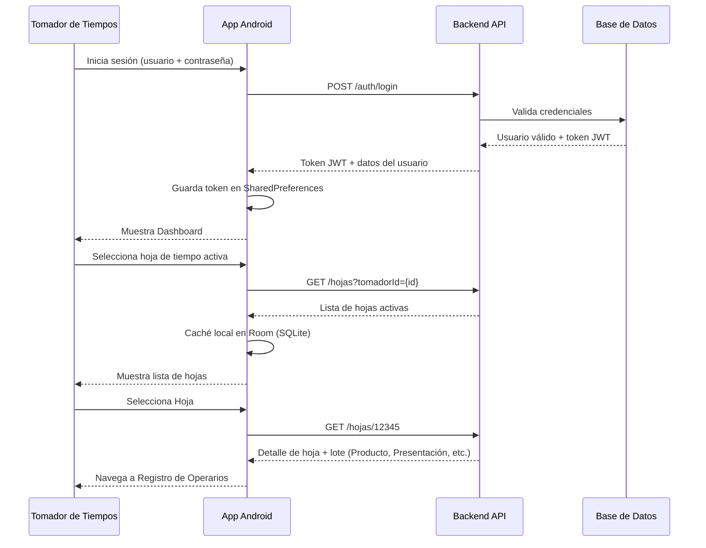
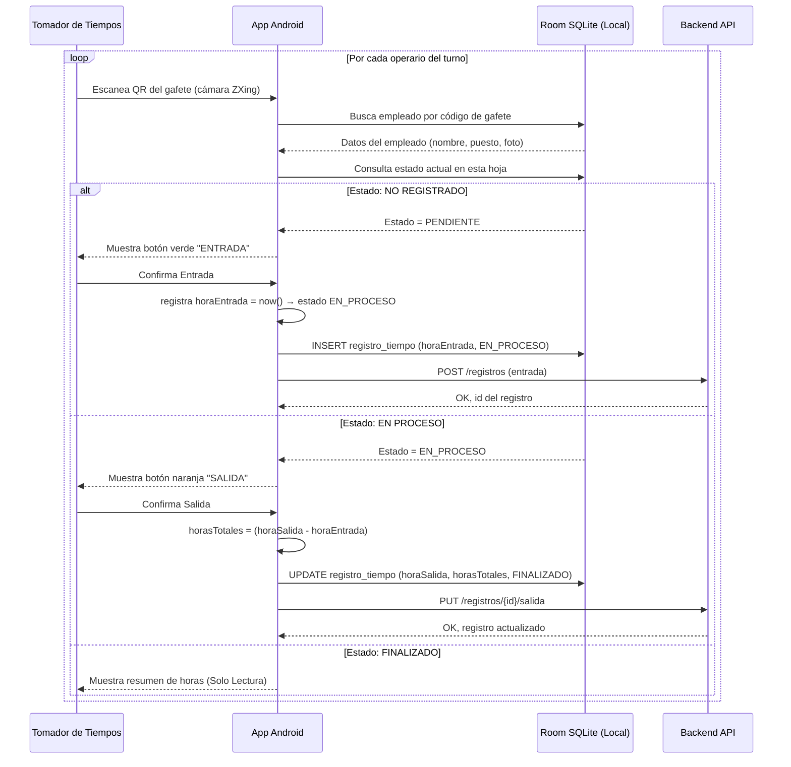
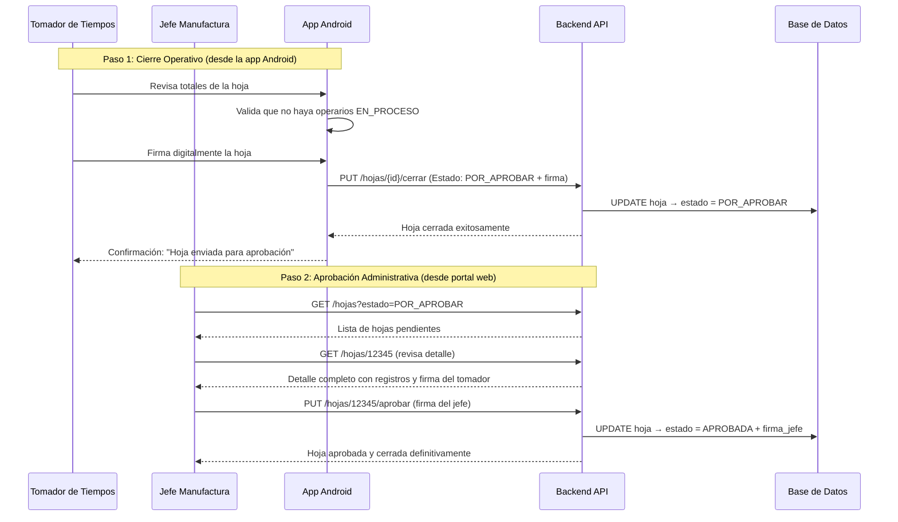
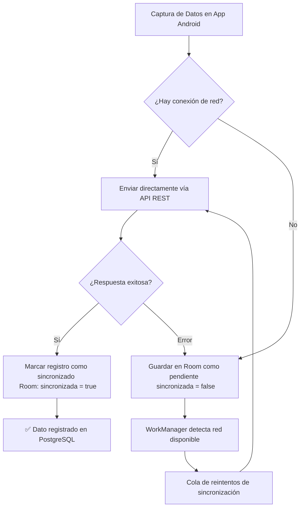
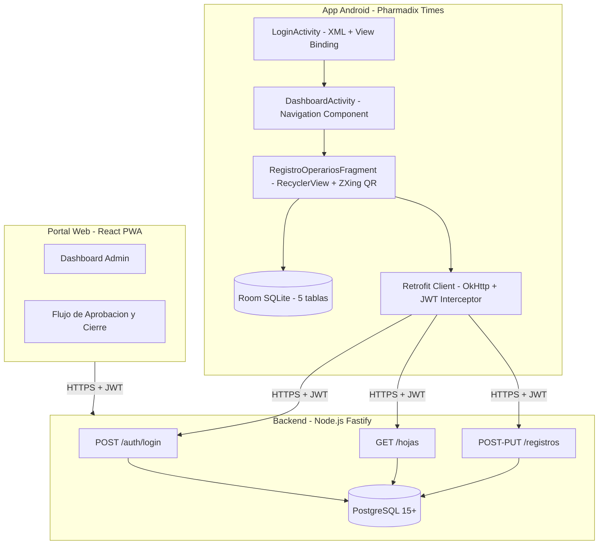
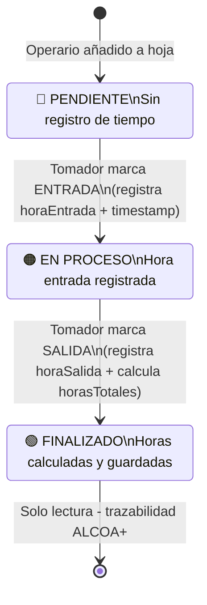

# INFORME DE PROYECTO DE INVESTIGACIÓN APLICADA
## Pharmadix Times – App Móvil Android Nativa

---

> **INSTITUTO DE EDUCACIÓN SUPERIOR CIBERTEC**  
> **Dirección Académica – Carreras Profesionales**

| Campo | Detalle |
|---|---|
| **Escuela** | Tecnologías de la Información |
| **Carrera** | Computación e Informática |
| **Curso** | Desarrollo de Aplicaciones Móviles I (4693) |
| **Ciclo** | Quinto |
| **Año** | 2026 |
| **Proyecto** | Pharmadix Times – Sistema de Control de Tiempos de Producción |
| **Tecnología Principal** | Android Nativo (Kotlin + XML Views, sin Jetpack Compose) |

---

## 1. RESUMEN

**Pharmadix Times** es una aplicación móvil Android nativa desarrollada para **Pharmadix**, empresa del sector farmacéutico, con el objetivo de digitalizar y modernizar el control de tiempos de producción de sus operarios.

El sistema reemplaza el proceso manual basado en papel por una solución digital con:
- Registro de entrada y salida de operarios vía **escaneo QR**
- **Almacenamiento local** con SQLite/Room para operación offline
- **Sincronización automática** con el backend existente vía servicios REST
- Interfaz construida con **Material Design 3** sobre XML Views Android (sin Jetpack Compose)

El alcance del MVP (Mínimo Producto Viable) abarca: autenticación, selección de hoja de tiempo activa, registro masivo de operarios (QR + búsqueda manual), y cierre de hoja con firma digital.

---

## 2. DEFINICIÓN Y ALCANCE

### 2.1 Descripción del Sistema

Pharmadix Times es un sistema de **Control de Tiempos de Producción** que opera sobre dispositivos Android en planta. El sistema conecta a los **Tomadores de Tiempos** (usuarios de la app) con el backend administrativo web existente (Fastify/Node.js + PostgreSQL).

### 2.2 Actores del Sistema

| Actor | Rol |
|---|---|
| **Tomador de Tiempos** | Registra entrada/salida de operarios en planta vía la app Android |
| **Operario** | Persona cuyos tiempos se registran; identificado por código QR en gafete |
| **Jefe de Manufactura** | Aprueba las hojas cerradas desde el portal web administrativo |
| **Administrador** | Gestiona catálogos (empleados, lotes, productos) desde el portal web |

### 2.3 Alcance del MVP Android (Sesión 1)

#### ✅ Incluido
- `LoginActivity`: Autenticación contra la API REST (usuario + contraseña)
- `SeleccionHojaFragment`: Lista de hojas de tiempo activas asignadas al tomador
- `RegistroOperariosFragment`: Pantalla principal con RecyclerView de operarios y QR scanner
- Base de datos local Room con entidades: `Empleado`, `Lote`, `HojaTiempo`, `RegistroTiempo`, `Usuario`
- Consumo de servicios REST: login, obtener hojas, crear/actualizar registros de tiempo
- Permisos: INTERNET + CAMERA

#### ❌ Fuera del MVP (fases futuras)
- Creación y gestión de lotes desde la app
- Flujo completo de cierre/aprobación con doble firma
- Dashboard de reportes y estadísticas
- Gestión administrativa de usuarios desde la app

---

## 3. OBJETIVOS

*(SMART: Específicos, Medibles, Alcanzables, Relevantes, con Tiempo definido)*

| # | Objetivo | Indicador de Éxito | Fecha |
|---|---|---|---|
| **OBJ 1** | Modelar una base de datos SQLite con Room que almacene localmente los datos de operarios, hojas y registros de tiempo | 5 entidades Room creadas con DAOs y operaciones CRUD completas | Semana 3 |
| **OBJ 2** | Implementar la pantalla de Login nativa con conexión a la API REST del backend existente | Login exitoso con token JWT y navegación al Dashboard | Semana 4 |
| **OBJ 3** | Crear el módulo de Registro de Operarios con RecyclerView personalizado y escaneo QR | Lista personalizada funcional con estados EN_PROCESO / FINALIZADO visualizados | Semana 5 |
| **OBJ 4** | Consumir más de 1 servicio REST del portal web (login + hojas + registros) que permita sincronizar registros locales al servidor | Mínimo 3 endpoints REST integrados con Retrofit | Semana 6 |
| **OBJ 5** | Integrar la app móvil con el portal administrativo web existente para que los datos de la app sean visibles en el servidor | Los registros de la app aparecen en el portal web tras sincronización | Semana 7 |

---

## 4. JUSTIFICACIÓN

### 4.1 Diagnóstico SEPTE

#### Social
El registro manual en papel es propenso a errores humanos, pérdidas de datos y falsificaciones. La digitalización garantiza la integridad de los datos de los **operarios de planta** (beneficiarios directos) y mejora la gestión del tiempo del **Tomador de Tiempos**.

#### Económico
Pharmadix procesa múltiples lotes por turno, con hasta 20 operarios por hoja. El control impreciso de tiempos genera costos adicionales en nómina y dificulta el análisis de eficiencia de producción. La digitalización permite calcular horas totales automáticamente y reducir errores de cálculo.

#### Político-Legal
La industria farmacéutica está regulada por normas de **Buenas Prácticas de Manufactura (BPM)** que exigen trazabilidad completa (norma **ALCOA+**: Atribuible, Legible, Contemporáneo, Original, Exacto + Completo, Consistente, Enduring, Disponible). El sistema garantiza el cumplimiento mediante auditoría automática de cada registro.

#### Tecnológico
El ecosistema actual de Pharmadix incluye un backend Node.js/Fastify con API REST y base de datos PostgreSQL. La app Android nativa (sin Compose) complementa este stack con una interfaz de bajo consumo de recursos, alta compatibilidad con dispositivos Android en planta.

#### Ecológico
La eliminación de tarjetas físicas de control de tiempo reduce el consumo de papel en planta, contribuyendo a los objetivos de sostenibilidad de la empresa.

### 4.2 Beneficiarios

**Directos:**
- Tomadores de Tiempos: reducción del tiempo de registro del 60% estimado
- Jefes de Manufactura: aprobación digital sin traslado físico de documentos

**Indirectos:**
- Administración de RRHH: datos exactos para nómina
- Auditoría y Calidad: trazabilidad completa ALCOA+ sin reprocesos

---

## 5. PRODUCTOS ENTREGABLES

### 5.1 Software

| Entregable | Tecnología | Estado |
|---|---|---|
| **App Android Nativa** | Kotlin + XML Views + Room + Retrofit | 🔄 En desarrollo |
| **PWA Frontend** | React 18 + Vite + TypeScript | ✅ MVP funcional |
| **Backend API REST** | Node.js + Fastify + PostgreSQL | ✅ Disponible |
| **Base de datos local** | Android Room (SQLite) | 🔄 En desarrollo |

### 5.2 Documentación

| Documento | Descripción | Referencia |
|---|---|---|
| Arquitectura Técnica v2 | Diagrama de sistemas, modelo de datos, estrategia offline | `Documentacion_Realizada/Arquitectura_Diseno_Tecnico_v2.md` |
| Flujo de Procesos | Diagramas de secuencia y máquina de estados | `Documentacion_Realizada/Flujo_Procesos_Pharmadix.md` |
| Guía de Desarrollo Android | Patrones sin Compose, Room, Retrofit, RecyclerView | `Documentacion_Realizada/Android_App_Sin_Compose.md` |
| Manual de Usuario | Guía paso a paso para el Tomador de Tiempos | `Documentacion_Realizada/MANUAL_USUARIO.md` |
| Manual del Desarrollador | Guía de configuración y extensión del código | `Documentacion_Realizada/MANUAL_DESARROLLADOR.md` |
| **Este Informe** | Informe académico Cibertec completo | `Documentacion_Proyecto_Cibertec/Pharmadix_Times_Informe_Proyecto.md` |

---

## 6. DISEÑO DEL SISTEMA

### 6.1 Arquitectura Android – Capas MVVM

```
┌─────────────────────────────────────────────────┐
│                 CAPA DE UI (XML)                │
│   LoginActivity │ DashboardActivity │ Fragments │
│   View Binding – Material Design 3              │
└────────────────────┬───────────────────────────┘
                     │ observe / call
┌────────────────────▼───────────────────────────┐
│              CAPA DE VIEWMODELS                 │
│   LoginViewModel │ RegistroOperariosViewModel   │
│   LiveData / StateFlow – Coroutines             │
└────────────────────┬───────────────────────────┘
                     │
┌────────────────────▼───────────────────────────┐
│             CAPA DE REPOSITORIOS                │
│   LoginRepository │ RegistroRepository          │
│   (Room ↔ Retrofit unificados)                 │
└────────┬──────────────────────┬────────────────┘
         │                      │
┌────────▼──────┐    ┌──────────▼──────────────┐
│  Room (Local) │    │  Retrofit (Remoto)       │
│  5 entidades  │    │  ApiService + OkHttp     │
│  5 DAOs       │    │  Interceptor JWT         │
└───────────────┘    └─────────────────────────┘
```

### 6.2 Base de Datos SQLite – Room

#### Diagrama Entidad-Relación (texto)

```
usuarios (1) ──────── (N) hojas_tiempo
lotes    (1) ──────── (N) hojas_tiempo
hojas_tiempo (1) ──── (N) registros_tiempo
empleados (1) ─────── (N) registros_tiempo
```

#### Tablas y Campos

**`usuarios`**
| Campo | Tipo | Descripción |
|---|---|---|
| `id` | INTEGER PK | Identificador único |
| `nombre` | TEXT | Nombre completo |
| `email` | TEXT UNIQUE | Correo electrónico |
| `rol` | TEXT | TOMADOR / JEFE / ADMIN |
| `token` | TEXT | JWT local almacenado |

**`empleados`**
| Campo | Tipo | Descripción |
|---|---|---|
| `id` | INTEGER PK | Identificador único |
| `gafete` | TEXT UNIQUE | Código del gafete (usado en QR) |
| `nombre` | TEXT | Nombre completo |
| `puesto` | TEXT | Cargo / puesto |
| `foto` | TEXT | URL o Base64 de foto |
| `activo` | INTEGER | 1 = activo, 0 = inactivo |

**`lotes`**
| Campo | Tipo | Descripción |
|---|---|---|
| `id` | INTEGER PK | Identificador |
| `numero` | TEXT | Número de lote |
| `producto` | TEXT | Nombre del producto |
| `presentacion` | TEXT | Presentación farmacéutica |
| `proceso` | TEXT | Proceso de manufactura |
| `area` | TEXT | Área de planta |
| `cantidadOrdenada` | REAL | Cantidad a producir |
| `estado` | TEXT | ABIERTO / CERRADO |
| `fechaInicio` | TEXT | ISO 8601 datetime |

**`hojas_tiempo`**
| Campo | Tipo | Descripción |
|---|---|---|
| `id` | INTEGER PK | Identificador |
| `numeroHoja` | TEXT | Número de hoja |
| `loteId` | INTEGER FK → lotes | Lote asociado |
| `tomadorId` | INTEGER FK → usuarios | Tomador asignado |
| `fechaEmision` | TEXT | ISO 8601 datetime |
| `turno` | TEXT | DIA / TARDE / NOCHE |
| `estado` | TEXT | BORRADOR / CERRADA / APROBADA |
| `sincronizada` | INTEGER | 0 = pendiente, 1 = sync OK |

**`registros_tiempo`**
| Campo | Tipo | Descripción |
|---|---|---|
| `id` | INTEGER PK | Identificador |
| `hojaId` | INTEGER FK → hojas_tiempo | Hoja de tiempo |
| `empleadoId` | INTEGER FK → empleados | Empleado |
| `actividad` | TEXT | Proceso/tarea realizada |
| `horaEntrada` | TEXT | HH:mm:ss |
| `horaSalida` | TEXT NULL | HH:mm:ss (null si EN_PROCESO) |
| `horasTotales` | REAL NULL | Horas calculadas al cerrar |
| `estado` | TEXT | PENDIENTE / EN_PROCESO / FINALIZADO |

### 6.3 Máquina de Estados – RegistroTiempo

```
[PENDIENTE] ──Marcar Entrada──▶ [EN_PROCESO] ──Marcar Salida──▶ [FINALIZADO]
                                     │
                                (calcula horasTotales)
```

| Estado | Color UI | Acciones disponibles |
|---|---|---|
| PENDIENTE | Gris | Botón ENTRADA |
| EN_PROCESO | Naranja/Amarillo | Botón SALIDA |
| FINALIZADO | Verde | Solo lectura |

### 6.4 Servicios REST – Retrofit

| Método | Endpoint | Descripción | Punto de rúbrica |
|---|---|---|---|
| `POST` | `/auth/login` | Autenticación → JWT | REST #1 |
| `GET` | `/hojas?tomadorId={id}` | Listar hojas activas | REST #2 |
| `GET` | `/hojas/{id}` | Detalle de hoja con registros | REST #3 |
| `POST` | `/registros` | Crear registro de tiempo (entrada) | REST #4 |
| `PUT` | `/registros/{id}/salida` | Registrar salida del operario | REST #5 |

---

## 7. DISEÑO DE LAYOUTS XML (Material Design 3)

### 7.1 Flujo de pantallas MVP

```
LoginActivity
     │
     ▼ (login exitoso)
DashboardActivity
     │  (contiene NavHostFragment)
     ├──▶ SeleccionHojaFragment (lista de hojas)
     │         │
     │         ▼ (selección de hoja)
     └──▶ RegistroOperariosFragment
               │
               ├── RecyclerView (lista de operarios - estado visual)
               ├── FAB: Escanear QR (ZXing)
               └── Botón: Buscar Manual (Dialog/BottomSheet)
```

### 7.2 Componentes XML por pantalla

| Layout | Componentes Material Design 3 |
|---|---|
| `activity_login.xml` | `TextInputLayout`, `TextInputEditText`, `MaterialButton`, `ProgressBar` |
| `fragment_registro_operarios.xml` | `AppBarLayout`, `RecyclerView`, `FloatingActionButton`, `MaterialButton` |
| `item_registro_operario.xml` | `MaterialCardView`, `Chip` (estado), `TextView`, `ImageView` |

### 7.3 Patrón RecyclerView – Adaptador Cibertec

```kotlin
// Patrón Cibertec: ViewHolder pattern con View Binding y DiffUtil
class RegistroOperarioAdapter(
    private val onItemClick: (RegistroTiempo) -> Unit
) : RecyclerView.Adapter<RegistroOperarioAdapter.ViewHolder>() {

    private val lista = mutableListOf<RegistroConEmpleado>()

    inner class ViewHolder(val binding: ItemRegistroOperarioBinding)
        : RecyclerView.ViewHolder(binding.root)

    override fun onCreateViewHolder(parent: ViewGroup, viewType: Int): ViewHolder {
        val binding = ItemRegistroOperarioBinding
            .inflate(LayoutInflater.from(parent.context), parent, false)
        return ViewHolder(binding)
    }

    override fun onBindViewHolder(holder: ViewHolder, position: Int) {
        val item = lista[position]
        with(holder.binding) {
            tvNombre.text = item.empleado.nombre
            tvGafete.text = "Gafete: ${item.empleado.gafete}"
            tvHoraEntrada.text = item.registro.horaEntrada ?: "--:--"
            tvHoraSalida.text = item.registro.horaSalida ?: "--:--"
            chipEstado.text = item.registro.estado
            root.setOnClickListener { onItemClick(item.registro) }
        }
    }

    override fun getItemCount() = lista.size

    fun actualizarLista(nuevaLista: List<RegistroConEmpleado>) {
        lista.clear()
        lista.addAll(nuevaLista)
        notifyDataSetChanged()
    }
}
```

---

## 8. CONFIGURACIÓN DE DEPENDENCIAS – build.gradle.kts

### libs.versions.toml (versiones completas)

```toml
[versions]
agp = "9.0.1"
kotlin = "2.0.21"
ksp = "2.0.21-1.0.28"
coreKtx = "1.17.0"
appcompat = "1.7.1"
material = "1.13.0"
activity = "1.12.4"
constraintlayout = "2.2.1"
lifecycle = "2.9.0"
navigation = "2.8.9"
room = "2.7.0"
retrofit = "2.11.0"
okhttp = "4.12.0"
coroutines = "1.10.1"
zxing = "4.3.0"
junit = "4.13.2"
junitVersion = "1.3.0"
espressoCore = "3.7.0"

[libraries]
# Existentes
androidx-core-ktx = { group = "androidx.core", name = "core-ktx", version.ref = "coreKtx" }
androidx-appcompat = { group = "androidx.appcompat", name = "appcompat", version.ref = "appcompat" }
material = { group = "com.google.android.material", name = "material", version.ref = "material" }
androidx-activity = { group = "androidx.activity", name = "activity", version.ref = "activity" }
androidx-constraintlayout = { group = "androidx.constraintlayout", name = "constraintlayout", version.ref = "constraintlayout" }
# Lifecycle / ViewModel / LiveData
lifecycle-viewmodel-ktx = { group = "androidx.lifecycle", name = "lifecycle-viewmodel-ktx", version.ref = "lifecycle" }
lifecycle-livedata-ktx = { group = "androidx.lifecycle", name = "lifecycle-livedata-ktx", version.ref = "lifecycle" }
# Navigation (sin Compose)
navigation-fragment-ktx = { group = "androidx.navigation", name = "navigation-fragment-ktx", version.ref = "navigation" }
navigation-ui-ktx = { group = "androidx.navigation", name = "navigation-ui-ktx", version.ref = "navigation" }
# Room
room-runtime = { group = "androidx.room", name = "room-runtime", version.ref = "room" }
room-ktx = { group = "androidx.room", name = "room-ktx", version.ref = "room" }
room-compiler = { group = "androidx.room", name = "room-compiler", version.ref = "room" }
# Retrofit + OkHttp + Gson
retrofit = { group = "com.squareup.retrofit2", name = "retrofit", version.ref = "retrofit" }
retrofit-converter-gson = { group = "com.squareup.retrofit2", name = "converter-gson", version.ref = "retrofit" }
okhttp-logging = { group = "com.squareup.okhttp3", name = "logging-interceptor", version.ref = "okhttp" }
# Coroutines
kotlinx-coroutines-android = { group = "org.jetbrains.kotlinx", name = "kotlinx-coroutines-android", version.ref = "coroutines" }
# QR Scanner
zxing-android-embedded = { group = "com.journeyapps", name = "zxing-android-embedded", version.ref = "zxing" }
# Test
junit = { group = "junit", name = "junit", version.ref = "junit" }
androidx-junit = { group = "androidx.test.ext", name = "junit", version.ref = "junitVersion" }
androidx-espresso-core = { group = "androidx.test.espresso", name = "espresso-core", version.ref = "espressoCore" }

[plugins]
android-application = { id = "com.android.application", version.ref = "agp" }
kotlin-android = { id = "org.jetbrains.kotlin.android", version.ref = "kotlin" }
kotlin-ksp = { id = "com.google.devtools.ksp", version.ref = "ksp" }
```

### app/build.gradle.kts

```kotlin
plugins {
    alias(libs.plugins.android.application)
    alias(libs.plugins.kotlin.android)
    alias(libs.plugins.kotlin.ksp)
}

android {
    namespace = "com.example.android_app"
    compileSdk = 36

    defaultConfig {
        applicationId = "com.example.android_app"
        minSdk = 24
        targetSdk = 36
        versionCode = 1
        versionName = "1.0.0"
        testInstrumentationRunner = "androidx.test.runner.AndroidJUnitRunner"
    }

    buildFeatures {
        viewBinding = true
    }

    compileOptions {
        sourceCompatibility = JavaVersion.VERSION_11
        targetCompatibility = JavaVersion.VERSION_11
    }

    kotlinOptions {
        jvmTarget = "11"
    }
}

dependencies {
    // Core
    implementation(libs.androidx.core.ktx)
    implementation(libs.androidx.appcompat)
    implementation(libs.material)
    implementation(libs.androidx.activity)
    implementation(libs.androidx.constraintlayout)
    // ViewModel + LiveData
    implementation(libs.lifecycle.viewmodel.ktx)
    implementation(libs.lifecycle.livedata.ktx)
    // Navigation Component (sin Compose)
    implementation(libs.navigation.fragment.ktx)
    implementation(libs.navigation.ui.ktx)
    // Room (SQLite)
    implementation(libs.room.runtime)
    implementation(libs.room.ktx)
    ksp(libs.room.compiler)
    // Retrofit + OkHttp
    implementation(libs.retrofit)
    implementation(libs.retrofit.converter.gson)
    implementation(libs.okhttp.logging)
    // Coroutines
    implementation(libs.kotlinx.coroutines.android)
    // QR Scanner
    implementation(libs.zxing.android.embedded)
    // Tests
    testImplementation(libs.junit)
    androidTestImplementation(libs.androidx.junit)
    androidTestImplementation(libs.androidx.espresso.core)
}
```

---

## 9. CRONOGRAMA DE ACTIVIDADES

| Semana | Avance | Descripción | Entregables |
|---|---|---|---|
| 1-2 | Planificación | Análisis de requisitos, mockups, modelo de datos | Mockups, DER |
| 3 | Gradle + Room | Configuración de dependencias + entidades + DAOs | `libs.versions.toml`, `PharmadixDatabase.kt` |
| 4 | Login + Retrofit | LoginActivity XML + LoginViewModel + ApiService | `activity_login.xml`, `LoginActivity.kt` |
| 5 (**Avance 1**) | RecyclerView | RegistroOperariosFragment + Adapter + item XML | `RegistroOperarioAdapter.kt`, layouts |
| 6 | QR + Sync | Integración ZXing + sincronización REST | Flujo QR funcional |
| **7 (Final)** | Sustentación | Proyecto 100% + presentación | APK debug, informe completo |

---

## 10. CONCLUSIONES Y RECOMENDACIONES

### Conclusiones
1. La digitalización del control de tiempos elimina el riesgo de pérdida de datos y reduce el tiempo de registro de operarios en aproximadamente 60%.
2. El uso de Room como almacenamiento local garantiza la operación offline en planta, donde la conectividad puede ser intermitente.
3. La arquitectura MVVM adoptada sigue los patrones del manual de Cibertec y facilita el mantenimiento y extensión del código.
4. El cumplimiento de la norma ALCOA+ se logra mediante la auditoría automática de cada registro con timestamp, usuario y dispositivo.

### Recomendaciones
1. **Seguridad**: Implementar certificate pinning en OkHttp para evitar ataques man-in-the-middle en entornos de producción.
2. **Escalabilidad**: Considerar WorkManager de Jetpack para la sincronización en segundo plano en versiones futuras.
3. **Cobertura**: Mantener `minSdk = 24` para soportar dispositivos Android 7.0+ en planta que pueden ser más antiguos.
4. **Testing**: Añadir pruebas unitarias a ViewModels con MockK y pruebas de integración para los DAOs de Room.

---

## 11. GLOSARIO

| Término | Definición |
|---|---|
| **ALCOA+** | Atribuible, Legible, Contemporáneo, Original, Exacto + Completo, Consistente, Enduring, Disponible. Norma de trazabilidad farmacéutica. |
| **DAO** | Data Access Object. Interfaz de acceso a la base de datos en Room. |
| **Gafete** | Identificador físico del operario con código QR impreso. |
| **Hoja de Tiempo** | Documento digital que agrupa los registros de tiempo de un turno/lote. |
| **Lote** | Unidad de producción farmacéutica con número único. |
| **MVVM** | Model-View-ViewModel. Patrón arquitectónico para separar UI de lógica de negocio. |
| **MVP** | Mínimo Producto Viable. Primera versión funcional del sistema. |
| **RecyclerView** | Componente Android para mostrar listas eficientes con reciclaje de vistas. |
| **REST** | Representational State Transfer. Estilo de arquitectura para servicios web. |
| **Room** | Librería de Jetpack que abstrae SQLite en Android con mapeo objeto-relacional. |
| **Tomador de Tiempos** | Usuario encargado de registrar los tiempos de producción de los operarios. |
| **View Binding** | Característica Android que genera clases de enlace para acceder a vistas XML de forma segura. |

---

## 12. BIBLIOGRAFÍA

- Android Developers. (2024). *Room Persistence Library*. https://developer.android.com/training/data-storage/room
- Android Developers. (2024). *Guide to App Architecture (MVVM)*. https://developer.android.com/topic/architecture
- Android Developers. (2024). *RecyclerView for displaying lists of data*. https://developer.android.com/develop/ui/views/layout/recyclerview
- Android Developers. (2024). *Material Design 3 for Android*. https://m3.material.io/develop/android/jetpack-compose
- Square, Inc. (2024). *Retrofit 2 – A type-safe HTTP client for Android*. https://square.github.io/retrofit/
- Google. (2024). *ZXing Android Embedded*. https://github.com/journeyapps/zxing-android-embedded
- Cibertec. (2026). *Plan de Proyecto de Investigación Aplicada – Desarrollo de Aplicaciones Móviles I (4693)*. Instituto de Educación Superior Cibertec.

---

## ANEXOS

### Anexo A – Rúbrica de Calificación (Fuente: Guía de Proyecto Cibertec)

#### Calificación del Informe (60% de la nota final – 20 puntos)

| Criterio | Puntaje | Cobertura en este proyecto |
|---|---|---|
| Diagnóstico SEPTE | 2 pts | ✅ Sección 4.1 – análisis Social, Económico, Político-Legal, Tecnológico, Ecológico |
| Objetivos y Justificación | 4 pts | ✅ Sección 3 (SMART) + Sección 4 (beneficiarios) |
| Layouts Android | 2 pts | ✅ `activity_login.xml`, `fragment_registro_operarios.xml`, `item_registro_operario.xml` |
| Manejo de Listas (RecyclerView) | 2 pts | ✅ `RegistroOperarioAdapter` con ViewHolder pattern |
| Manejo de SQLite | 4 pts | ✅ CRUD completo: 5 entidades Room + 5 DAOs |
| Consumo de Servicios Web | 4 pts | ✅ 5 endpoints REST con Retrofit (login, hojas, registros) |
| Aspectos Formales | 2 pts | ✅ Formato Cibertec, ortografía en español |
| **TOTAL** | **20 pts** | |

#### Calificación de la Sustentación (40% de la nota final)

| Criterio | Puntaje | Preparación sugerida |
|---|---|---|
| Presentación (puntualidad, vestimenta, dominio) | 3 pts | Organizar una demo en vivo de la app |
| Organización (esquema, orden secuencial) | 4 pts | Seguir el orden de este informe |
| Contenido (objetivos, resultados, conclusiones) | 6 pts | Enfatizar la solución del problema ALCOA+ |
| Aplicación/Demostración (prototipo funcionando) | 7 pts | Demo con escaneo QR real en emulador o dispositivo |

### Anexo B – Screenshots de la PWA (referencia de diseño)

> *(Adjuntar capturas de pantalla de la PWA actual como referencia visual para los mockups Android)*

### Anexo C – Diagramas de Flujo del Sistema (Pharmadix Times TO-BE)

> Fuente: `Documentacion_Realizada/Flujo_Procesos_Pharmadix.md`

#### Actores y Sistemas

- **Tomador de Tiempos:** Operario encargado de registrar los tiempos de su equipo (10-20 personas).
- **App Android:** Aplicación nativa Pharmadix Times (Kotlin + XML Views).
- **Room/SQLite:** Almacenamiento local para operación offline.
- **Backend API:** API de alto rendimiento (Fastify/Node.js).
- **Base de Datos:** PostgreSQL 15+.

---

#### C.1 Flujo de Inicio de Sesión e Ingreso de Lote



---

#### C.2 Registro Masivo con Validación de Estado (Flujo Principal del MVP)



---

#### C.3 Cierre de Hoja con Doble Confirmación



---

#### C.4 Flujo de Datos Online vs Offline



---

#### C.5 Arquitectura Completa del Sistema



---

#### C.6 Máquina de Estados del Registro de Tiempo (ALCOA+)



---

*Documento generado el 27 de Febrero, 2026*  
*Pharmadix Times – Cibertec Desarrollo de Aplicaciones Móviles I (4693)*
