# INFORME DE PROYECTO DE INVESTIGACIÓN APLICADA
## Pharmadix Times – App Móvil Android Nativa

---

> **INSTITUTO DE EDUCACIÓN SUPERIOR CIBERTEC**  
> **Dirección Académica – Carreras Profesionales**

| Campo | Detalle |
|---|---|
| **Escuela** | Tecnologías de la Información |
| **Carrera** | Computación e Informática |
| **Curso** | Desarrollo de Aplicaciones Móviles I (4693) |
| **Ciclo** | Quinto |
| **Año** | 2026 |
| **Proyecto** | Pharmadix Times – Sistema de Control de Tiempos de Producción |
| **Tecnología Principal** | Android Nativo (Kotlin + XML Views, sin Jetpack Compose) |
| **Repositorio GitHub** | [https://github.com/Josesaso45/Pharmadix_Form_Horas_Extras_Cibertec](https://github.com/Josesaso45/Pharmadix_Form_Horas_Extras_Cibertec) |

---

## 1. RESUMEN

**Pharmadix Times** es una aplicación móvil Android nativa desarrollada para **Pharmadix**, empresa del sector farmacéutico, con el objetivo de digitalizar y modernizar el control de tiempos de producción de sus operarios.

El sistema reemplaza el proceso manual basado en papel por una solución digital con:
- Registro de entrada y salida de operarios vía **escaneo QR**
- **Almacenamiento local** con SQLite/Room para operación offline
- **Sincronización automática** con el backend existente vía servicios REST
- Interfaz construida con **Material Design 3** sobre XML Views Android (sin Jetpack Compose)

El alcance del MVP (Mínimo Producto Viable) abarca: autenticación, selección de hoja de tiempo activa, registro masivo de operarios (QR + búsqueda manual), y cierre de hoja con firma digital.

---

## 2. DEFINICIÓN Y ALCANCE

### 2.1 Descripción del Sistema

Pharmadix Times es un sistema de **Control de Tiempos de Producción** que opera sobre dispositivos Android en planta. El sistema conecta a los **Tomadores de Tiempos** (usuarios de la app) con el backend administrativo web existente (Fastify/Node.js + PostgreSQL).

### 2.2 Actores del Sistema

| Actor | Rol |
|---|---|
| **Tomador de Tiempos** | Registra entrada/salida de operarios en planta vía la app Android |
| **Operario** | Persona cuyos tiempos se registran; identificado por código QR en gafete |
| **Jefe de Manufactura** | Aprueba las hojas cerradas desde el portal web administrativo |
| **Administrador** | Gestiona catálogos (empleados, lotes, productos) desde el portal web |

### 2.3 Alcance del MVP Android (Sesión 1)

#### ✅ Incluido
- `LoginActivity`: Autenticación contra la API REST (usuario + contraseña)
- `SeleccionHojaFragment`: Lista de hojas de tiempo activas asignadas al tomador
- `RegistroOperariosFragment`: Pantalla principal con RecyclerView de operarios y QR scanner
- Base de datos local Room con entidades: `Empleado`, `Lote`, `HojaTiempo`, `RegistroTiempo`, `Usuario`
- Consumo de servicios REST: login, obtener hojas, crear/actualizar registros de tiempo
- Permisos: INTERNET + CAMERA

#### ❌ Fuera del MVP (fases futuras)
- Creación y gestión de lotes desde la app
- Flujo completo de cierre/aprobación con doble firma
- Dashboard de reportes y estadísticas
- Gestión administrativa de usuarios desde la app

---

## 3. OBJETIVOS

*(SMART: Específicos, Medibles, Alcanzables, Relevantes, con Tiempo definido)*

| # | Objetivo | Indicador de Éxito | Fecha |
|---|---|---|---|
| **OBJ 1** | Modelar una base de datos SQLite con Room que almacene localmente los datos de operarios, hojas y registros de tiempo | 5 entidades Room creadas con DAOs y operaciones CRUD completas | Semana 3 |
| **OBJ 2** | Implementar la pantalla de Login nativa con conexión a la API REST del backend existente | Login exitoso con token JWT y navegación al Dashboard | Semana 4 |
| **OBJ 3** | Crear el módulo de Registro de Operarios con RecyclerView personalizado y escaneo QR | Lista personalizada funcional con estados EN_PROCESO / FINALIZADO visualizados | Semana 5 |
| **OBJ 4** | Consumir más de 1 servicio REST del portal web (login + hojas + registros) que permita sincronizar registros locales al servidor | Mínimo 3 endpoints REST integrados con Retrofit | Semana 6 |
| **OBJ 5** | Integrar la app móvil con el portal administrativo web existente para que los datos de la app sean visibles en el servidor | Los registros de la app aparecen en el portal web tras sincronización | Semana 7 |

---

## 4. JUSTIFICACIÓN

### 4.1 Diagnóstico SEPTE

#### Social
El registro manual en papel es propenso a errores humanos, pérdidas de datos y falsificaciones. La digitalización garantiza la integridad de los datos de los **operarios de planta** (beneficiarios directos) y mejora la gestión del tiempo del **Tomador de Tiempos**.

#### Económico
Pharmadix procesa múltiples lotes por turno, con hasta 20 operarios por hoja. El control impreciso de tiempos genera costos adicionales en nómina y dificulta el análisis de eficiencia de producción. La digitalización permite calcular horas totales automáticamente y reducir errores de cálculo.

#### Político-Legal
La industria farmacéutica está regulada por normas de **Buenas Prácticas de Manufactura (BPM)** que exigen trazabilidad completa (norma **ALCOA+**: Atribuible, Legible, Contemporáneo, Original, Exacto + Completo, Consistente, Enduring, Disponible). El sistema garantiza el cumplimiento mediante auditoría automática de cada registro.

#### Tecnológico
El ecosistema actual de Pharmadix incluye un backend Node.js/Fastify con API REST y base de datos PostgreSQL. La app Android nativa (sin Compose) complementa este stack con una interfaz de bajo consumo de recursos, alta compatibilidad con dispositivos Android en planta.

#### Ecológico
La eliminación de tarjetas físicas de control de tiempo reduce el consumo de papel en planta, contribuyendo a los objetivos de sostenibilidad de la empresa.

### 4.2 Beneficiarios

**Directos:**
- Tomadores de Tiempos: reducción del tiempo de registro del 60% estimado
- Jefes de Manufactura: aprobación digital sin traslado físico de documentos

**Indirectos:**
- Administración de RRHH: datos exactos para nómina
- Auditoría y Calidad: trazabilidad completa ALCOA+ sin reprocesos

---

## 5. PRODUCTOS ENTREGABLES

### 5.1 Software

| Entregable | Tecnología | Estado |
|---|---|---|
| **App Android Nativa** | Kotlin + XML Views + Room + Retrofit | 🔄 En desarrollo |
| **PWA Frontend** | React 18 + Vite + TypeScript | ✅ MVP funcional |
| **Backend API REST** | Node.js + Fastify + PostgreSQL | ✅ Disponible |
| **Base de datos local** | Android Room (SQLite) | 🔄 En desarrollo |

### 5.2 Documentación

| Documento | Descripción | Referencia |
|---|---|---|
| Arquitectura Técnica v2 | Diagrama de sistemas, modelo de datos, estrategia offline | `Documentacion_Realizada/Arquitectura_Diseno_Tecnico_v2.md` |
| Flujo de Procesos | Diagramas de secuencia y máquina de estados | `Documentacion_Realizada/Flujo_Procesos_Pharmadix.md` |
| Guía de Desarrollo Android | Patrones sin Compose, Room, Retrofit, RecyclerView | `Documentacion_Realizada/Android_App_Sin_Compose.md` |
| Manual de Usuario | Guía paso a paso para el Tomador de Tiempos | `Documentacion_Realizada/MANUAL_USUARIO.md` |
| Manual del Desarrollador | Guía de configuración y extensión del código | `Documentacion_Realizada/MANUAL_DESARROLLADOR.md` |
| **Este Informe** | Informe académico Cibertec completo | `Documentacion_Proyecto_Cibertec/Pharmadix_Times_Informe_Proyecto.md` |

---

## 6. DISEÑO DEL SISTEMA

### 6.1 Arquitectura Android – Capas MVVM

```
┌─────────────────────────────────────────────────┐
│                 CAPA DE UI (XML)                │
│   LoginActivity │ DashboardActivity │ Fragments │
│   View Binding – Material Design 3              │
└────────────────────┬───────────────────────────┘
                     │ observe / call
┌────────────────────▼───────────────────────────┐
│              CAPA DE VIEWMODELS                 │
│   LoginViewModel │ RegistroOperariosViewModel   │
│   LiveData / StateFlow – Coroutines             │
└────────────────────┬───────────────────────────┘
                     │
┌────────────────────▼───────────────────────────┐
│             CAPA DE REPOSITORIOS                │
│   LoginRepository │ RegistroRepository          │
│   (Room ↔ Retrofit unificados)                 │
└────────┬──────────────────────┬────────────────┘
         │                      │
┌────────▼──────┐    ┌──────────▼──────────────┐
│  Room (Local) │    │  Retrofit (Remoto)       │
│  5 entidades  │    │  ApiService + OkHttp     │
│  5 DAOs       │    │  Interceptor JWT         │
└───────────────┘    └─────────────────────────┘
```

### 6.2 Base de Datos SQLite – Room

#### Diagrama Entidad-Relación (texto)

```
usuarios (1) ──────── (N) hojas_tiempo
lotes    (1) ──────── (N) hojas_tiempo
hojas_tiempo (1) ──── (N) registros_tiempo
empleados (1) ─────── (N) registros_tiempo
```

#### Tablas y Campos

**`usuarios`**
| Campo | Tipo | Descripción |
|---|---|---|
| `id` | INTEGER PK | Identificador único |
| `nombre` | TEXT | Nombre completo |
| `email` | TEXT UNIQUE | Correo electrónico |
| `rol` | TEXT | TOMADOR / JEFE / ADMIN |
| `token` | TEXT | JWT local almacenado |

**`empleados`**
| Campo | Tipo | Descripción |
|---|---|---|
| `id` | INTEGER PK | Identificador único |
| `gafete` | TEXT UNIQUE | Código del gafete (usado en QR) |
| `nombre` | TEXT | Nombre completo |
| `puesto` | TEXT | Cargo / puesto |
| `foto` | TEXT | URL o Base64 de foto |
| `activo` | INTEGER | 1 = activo, 0 = inactivo |

**`lotes`**
| Campo | Tipo | Descripción |
|---|---|---|
| `id` | INTEGER PK | Identificador |
| `numero` | TEXT | Número de lote |
| `producto` | TEXT | Nombre del producto |
| `presentacion` | TEXT | Presentación farmacéutica |
| `proceso` | TEXT | Proceso de manufactura |
| `area` | TEXT | Área de planta |
| `cantidadOrdenada` | REAL | Cantidad a producir |
| `estado` | TEXT | ABIERTO / CERRADO |
| `fechaInicio` | TEXT | ISO 8601 datetime |

**`hojas_tiempo`**
| Campo | Tipo | Descripción |
|---|---|---|
| `id` | INTEGER PK | Identificador |
| `numeroHoja` | TEXT | Número de hoja |
| `loteId` | INTEGER FK → lotes | Lote asociado |
| `tomadorId` | INTEGER FK → usuarios | Tomador asignado |
| `fechaEmision` | TEXT | ISO 8601 datetime |
| `turno` | TEXT | DIA / TARDE / NOCHE |
| `estado` | TEXT | BORRADOR / CERRADA / APROBADA |
| `sincronizada` | INTEGER | 0 = pendiente, 1 = sync OK |

**`registros_tiempo`**
| Campo | Tipo | Descripción |
|---|---|---|
| `id` | INTEGER PK | Identificador |
| `hojaId` | INTEGER FK → hojas_tiempo | Hoja de tiempo |
| `empleadoId` | INTEGER FK → empleados | Empleado |
| `actividad` | TEXT | Proceso/tarea realizada |
| `horaEntrada` | TEXT | HH:mm:ss |
| `horaSalida` | TEXT NULL | HH:mm:ss (null si EN_PROCESO) |
| `horasTotales` | REAL NULL | Horas calculadas al cerrar |
| `estado` | TEXT | PENDIENTE / EN_PROCESO / FINALIZADO |

### 6.3 Máquina de Estados – RegistroTiempo

```
[PENDIENTE] ──Marcar Entrada──▶ [EN_PROCESO] ──Marcar Salida──▶ [FINALIZADO]
                                     │
                                (calcula horasTotales)
```

| Estado | Color UI | Acciones disponibles |
|---|---|---|
| PENDIENTE | Gris | Botón ENTRADA |
| EN_PROCESO | Naranja/Amarillo | Botón SALIDA |
| FINALIZADO | Verde | Solo lectura |

---

### 6.2.1 Entidades Room (`@Entity`) — Código Implementado

Las entidades son las clases Kotlin que Room mapea a tablas SQLite. Usan anotaciones `@Entity`, `@PrimaryKey` y `@ForeignKey`.

**`Empleado.kt`** — Catálogo de operarios de planta

```kotlin
@Entity(tableName = "empleados")
data class Empleado(
    @PrimaryKey(autoGenerate = false)
    val id: Int = 0,
    val gafete: String = "",      // Código del gafete (usado en escaneo QR)
    val nombre: String = "",
    val puesto: String = "",
    val foto: String? = null,     // URL o Base64
    val activo: Boolean = true
)
```

**`Lote.kt`** — Lotes de producción farmacéutica

```kotlin
@Entity(tableName = "lotes")
data class Lote(
    @PrimaryKey(autoGenerate = false)
    val id: Int = 0,
    val numero: String = "",
    val producto: String = "",
    val presentacion: String = "",
    val proceso: String = "",
    val area: String = "",
    val cantidadOrdenada: Double = 0.0,
    val estado: String = "ABIERTO",   // ABIERTO / CERRADO
    val fechaInicio: String = ""
)
```

**`HojaTiempo.kt`** — Hoja de control por lote y tomador

```kotlin
@Entity(
    tableName = "hojas_tiempo",
    foreignKeys = [ForeignKey(
        entity = Lote::class,
        parentColumns = ["id"],
        childColumns  = ["loteId"],
        onDelete      = ForeignKey.SET_NULL
    )],
    indices = [Index("loteId")]
)
data class HojaTiempo(
    @PrimaryKey(autoGenerate = false)
    val id: Int = 0,
    val numeroHoja: String = "",
    val loteId: Int? = null,
    val tomadorId: Int = 0,
    val fechaEmision: String = "",
    val turno: String = "DIA",          // DIA / TARDE / NOCHE
    val estado: String = "BORRADOR",    // BORRADOR / CERRADA / APROBADA
    val sincronizada: Boolean = false   // false = pendiente de sync con API
)
```

**`RegistroTiempo.kt`** — Registro individual de entrada/salida por operario

```kotlin
@Entity(
    tableName = "registros_tiempo",
    foreignKeys = [
        ForeignKey(entity = HojaTiempo::class,
            parentColumns = ["id"], childColumns = ["hojaId"],
            onDelete = ForeignKey.CASCADE),
        ForeignKey(entity = Empleado::class,
            parentColumns = ["id"], childColumns = ["empleadoId"],
            onDelete = ForeignKey.SET_NULL)
    ],
    indices = [Index("hojaId"), Index("empleadoId")]
)
data class RegistroTiempo(
    @PrimaryKey(autoGenerate = true)
    val id: Int = 0,
    val hojaId: Int = 0,
    val empleadoId: Int? = null,
    val actividad: String = "",
    val horaEntrada: String? = null,    // null si aún no ha entrado
    val horaSalida: String? = null,     // null si aún EN_PROCESO
    val horasTotales: Double? = null,   // calculado al marcar salida
    val estado: String = "PENDIENTE"    // PENDIENTE / EN_PROCESO / FINALIZADO
)
```

---

### 6.2.2 DAOs – Operaciones CRUD Implementadas

Los DAOs (Data Access Objects) definen las consultas SQLite que Room genera automáticamente. Cubren los 4 criterios de la rúbrica: **Búsqueda, Registro, Modificación y Borrado**.

**`EmpleadoDao.kt`**

```kotlin
@Dao
interface EmpleadoDao {
    // REGISTRO (INSERT)
    @Insert(onConflict = OnConflictStrategy.REPLACE)
    suspend fun insertar(empleado: Empleado)

    @Insert(onConflict = OnConflictStrategy.REPLACE)
    suspend fun insertarTodos(empleados: List<Empleado>)

    // MODIFICACION (UPDATE)
    @Update
    suspend fun actualizar(empleado: Empleado)

    // BORRADO (DELETE)
    @Delete
    suspend fun eliminar(empleado: Empleado)

    // BUSQUEDA (QUERY)
    @Query("SELECT * FROM empleados ORDER BY nombre ASC")
    fun obtenerTodos(): LiveData<List<Empleado>>

    @Query("SELECT * FROM empleados WHERE id = :id")
    suspend fun obtenerPorId(id: Int): Empleado?

    // Búsqueda por código QR del gafete (clave para el escaneo)
    @Query("SELECT * FROM empleados WHERE gafete = :gafete LIMIT 1")
    suspend fun obtenerPorGafete(gafete: String): Empleado?

    @Query("SELECT * FROM empleados WHERE activo = 1 ORDER BY nombre ASC")
    fun obtenerActivos(): LiveData<List<Empleado>>
}
```

**`RegistroTiempoDao.kt`** — DAO principal del flujo de tiempos

```kotlin
@Dao
interface RegistroTiempoDao {
    // REGISTRO
    @Insert(onConflict = OnConflictStrategy.REPLACE)
    suspend fun insertar(registro: RegistroTiempo): Long

    // MODIFICACION
    @Update
    suspend fun actualizar(registro: RegistroTiempo)

    // Marcar entrada: actualiza horaEntrada y cambia estado a EN_PROCESO
    @Query("UPDATE registros_tiempo SET horaEntrada = :hora, estado = 'EN_PROCESO' WHERE id = :id")
    suspend fun marcarEntrada(id: Int, hora: String)

    // Marcar salida: actualiza horaSalida, calcula horasTotales y cierra el registro
    @Query("UPDATE registros_tiempo SET horaSalida = :hora, horasTotales = :horas, estado = 'FINALIZADO' WHERE id = :id")
    suspend fun marcarSalida(id: Int, hora: String, horas: Double)

    // BORRADO
    @Delete
    suspend fun eliminar(registro: RegistroTiempo)

    // BUSQUEDA
    @Query("SELECT * FROM registros_tiempo WHERE hojaId = :hojaId ORDER BY id ASC")
    fun obtenerPorHoja(hojaId: Int): LiveData<List<RegistroTiempo>>

    @Query("SELECT * FROM registros_tiempo WHERE empleadoId = :empleadoId AND hojaId = :hojaId LIMIT 1")
    suspend fun obtenerPorEmpleadoYHoja(empleadoId: Int, hojaId: Int): RegistroTiempo?

    // Validación de regla de negocio: no cerrar hoja con operarios EN_PROCESO
    @Query("SELECT COUNT(*) FROM registros_tiempo WHERE hojaId = :hojaId AND estado = 'EN_PROCESO'")
    suspend fun contarEnProceso(hojaId: Int): Int
}
```

**`HojaTiempoDao.kt`** — CRUD de hojas + sincronización offline

```kotlin
@Dao
interface HojaTiempoDao {
    @Insert(onConflict = OnConflictStrategy.REPLACE)
    suspend fun insertar(hoja: HojaTiempo): Long

    @Update
    suspend fun actualizar(hoja: HojaTiempo)

    @Delete
    suspend fun eliminar(hoja: HojaTiempo)

    @Query("SELECT * FROM hojas_tiempo ORDER BY fechaEmision DESC")
    fun obtenerTodas(): LiveData<List<HojaTiempo>>

    @Query("SELECT * FROM hojas_tiempo WHERE tomadorId = :tomadorId ORDER BY fechaEmision DESC")
    fun obtenerPorTomador(tomadorId: Int): LiveData<List<HojaTiempo>>

    // Soporte Offline-First: obtener las hojas pendientes de sincronizar
    @Query("SELECT * FROM hojas_tiempo WHERE sincronizada = 0")
    suspend fun obtenerPendientesSincronizacion(): List<HojaTiempo>

    @Query("UPDATE hojas_tiempo SET sincronizada = 1 WHERE id = :id")
    suspend fun marcarComoSincronizada(id: Int)
}
```

---

### 6.2.3 Configuración de la Base de Datos (`PharmadixDatabase.kt`)

```kotlin
@Database(
    entities = [Empleado::class, Lote::class, HojaTiempo::class,
                RegistroTiempo::class, Usuario::class],
    version = 1,
    exportSchema = false
)
abstract class PharmadixDatabase : RoomDatabase() {

    abstract fun empleadoDao(): EmpleadoDao
    abstract fun hojaTiempoDao(): HojaTiempoDao
    abstract fun registroTiempoDao(): RegistroTiempoDao

    companion object {
        @Volatile
        private var INSTANCE: PharmadixDatabase? = null

        fun getInstance(context: Context): PharmadixDatabase {
            return INSTANCE ?: synchronized(this) {
                Room.databaseBuilder(
                    context.applicationContext,
                    PharmadixDatabase::class.java,
                    "pharmadix_times.db"
                ).build().also { INSTANCE = it }
            }
        }
    }
}
```

> **Patrón Singleton con `@Volatile`:** garantiza que solo se crea una instancia de la base de datos en toda la aplicación, evitando condiciones de carrera en entornos multihilo.


### 6.4 Servicios REST – Retrofit

La app consume **5 endpoints REST** del backend Node.js/Fastify utilizando la librería **Retrofit 2.11** con OkHttp como cliente HTTP y Gson para la serialización/deserialización JSON.

| Método | Endpoint | Descripción | Criterio |
|---|---|---|---|
| `POST` | `/auth/login` | Autenticación → JWT | REST #1 |
| `GET` | `/hojas?tomadorId={id}` | Listar hojas activas | REST #2 |
| `GET` | `/hojas/{id}` | Detalle de hoja | REST #3 |
| `POST` | `/registros` | Crear registro de entrada | REST #4 |
| `PUT` | `/registros/{id}/salida` | Registrar salida del operario | REST #5 |

---

### 6.4.1 Interfaz `ApiService.kt` (Definición de Endpoints)

```kotlin
interface ApiService {

    @POST("auth/login")
    suspend fun login(@Body request: LoginRequest): Response<LoginResponse>

    @GET("hojas")
    suspend fun obtenerHojas(
        @Query("tomadorId") tomadorId: Int
    ): Response<List<HojaTiempoResponse>>

    @GET("hojas/{id}")
    suspend fun obtenerHoja(
        @Path("id") id: Int
    ): Response<HojaTiempoResponse>

    @POST("registros")
    suspend fun registrarEntrada(
        @Body request: RegistroTiempoRequest
    ): Response<RegistroTiempoResponse>

    @PUT("registros/{id}/salida")
    suspend fun registrarSalida(
        @Path("id") registroId: Int,
        @Body request: RegistroSalidaRequest
    ): Response<RegistroTiempoResponse>
}
```

---

### 6.4.2 Cliente Retrofit con JWT Interceptor (`RetrofitClient.kt`)

```kotlin
object RetrofitClient {

    // 10.0.2.2 = localhost del PC de desarrollo desde el emulador Android
    private const val BASE_URL = "http://10.0.2.2:3000/"

    private var authToken: String = ""

    fun setToken(token: String) { authToken = token }

    // Interceptor que inyecta el token JWT en cada petición
    private val authInterceptor = Interceptor { chain ->
        val req = chain.request().newBuilder().apply {
            if (authToken.isNotEmpty())
                addHeader("Authorization", "Bearer $authToken")
        }.build()
        chain.proceed(req)
    }

    private val client = OkHttpClient.Builder()
        .addInterceptor(authInterceptor)
        .addInterceptor(HttpLoggingInterceptor().apply {
            level = HttpLoggingInterceptor.Level.BODY
        })
        .connectTimeout(30, TimeUnit.SECONDS)
        .readTimeout(30, TimeUnit.SECONDS)
        .build()

    val apiService: ApiService = Retrofit.Builder()
        .baseUrl(BASE_URL)
        .client(client)
        .addConverterFactory(GsonConverterFactory.create())
        .build()
        .create(ApiService::class.java)
}
```

---

### 6.4.3 Modelos de Datos Request/Response (`ApiModels.kt`)

```kotlin
// --- REQUEST ---
data class LoginRequest(
    @SerializedName("usuario")  val usuario: String,
    @SerializedName("password") val password: String
)

data class RegistroTiempoRequest(
    @SerializedName("hojaId")      val hojaId: Int,
    @SerializedName("empleadoId")  val empleadoId: Int,
    @SerializedName("actividad")   val actividad: String,
    @SerializedName("horaEntrada") val horaEntrada: String
)

data class RegistroSalidaRequest(
    @SerializedName("horaSalida") val horaSalida: String
)

// --- RESPONSE ---
data class LoginResponse(
    @SerializedName("token")   val token: String,
    @SerializedName("usuario") val usuario: UsuarioResponse
)

data class UsuarioResponse(
    @SerializedName("id")     val id: Int,
    @SerializedName("nombre") val nombre: String,
    @SerializedName("email")  val email: String,
    @SerializedName("rol")    val rol: String
)

data class HojaTiempoResponse(
    @SerializedName("id")           val id: Int,
    @SerializedName("numeroHoja")   val numeroHoja: String,
    @SerializedName("loteId")       val loteId: Int?,
    @SerializedName("tomadorId")    val tomadorId: Int,
    @SerializedName("fechaEmision") val fechaEmision: String,
    @SerializedName("turno")        val turno: String,
    @SerializedName("estado")       val estado: String
)

data class RegistroTiempoResponse(
    @SerializedName("id")           val id: Int,
    @SerializedName("hojaId")       val hojaId: Int,
    @SerializedName("empleadoId")   val empleadoId: Int,
    @SerializedName("horaEntrada")  val horaEntrada: String,
    @SerializedName("horaSalida")   val horaSalida: String?,
    @SerializedName("horasTotales") val horasTotales: Double?,
    @SerializedName("estado")       val estado: String
)
```

---

### 6.4.4 Ejemplos JSON de Request/Response

**Endpoint 1 — `POST /auth/login`**

```json
// REQUEST
{
  "usuario": "tomador01",
  "password": "pharmadix2026"
}

// RESPONSE 200 OK
{
  "token": "eyJhbGciOiJIUzI1NiIsInR5cCI6IkpXVCJ9...",
  "usuario": {
    "id": 5,
    "nombre": "Carlos Mejia",
    "email": "cmejia@pharmadix.com",
    "rol": "TOMADOR"
  }
}
```

**Endpoint 2 — `POST /registros` (Registrar Entrada)**

```json
// REQUEST
{
  "hojaId": 1042,
  "empleadoId": 87,
  "actividad": "Etiquetado",
  "horaEntrada": "07:15:00"
}

// RESPONSE 201 Created
{
  "id": 3291,
  "hojaId": 1042,
  "empleadoId": 87,
  "horaEntrada": "07:15:00",
  "horaSalida": null,
  "horasTotales": null,
  "estado": "EN_PROCESO"
}
```

**Endpoint 3 — `PUT /registros/3291/salida` (Registrar Salida)**

```json
// REQUEST
{
  "horaSalida": "15:30:00"
}

// RESPONSE 200 OK
{
  "id": 3291,
  "hojaId": 1042,
  "empleadoId": 87,
  "horaEntrada": "07:15:00",
  "horaSalida": "15:30:00",
  "horasTotales": 8.25,
  "estado": "FINALIZADO"
}
```


## 7. DISEÑO DE LAYOUTS XML (Material Design 3)

### 7.1 Flujo de pantallas MVP

```
LoginActivity
     │
     ▼ (login exitoso)
DashboardActivity
     │  (contiene NavHostFragment)
     ├──▶ SeleccionHojaFragment (lista de hojas)
     │         │
     │         ▼ (selección de hoja)
     └──▶ RegistroOperariosFragment
               │
               ├── RecyclerView (lista de operarios - estado visual)
               ├── FAB: Escanear QR (ZXing)
               └── Botón: Buscar Manual (Dialog/BottomSheet)
```

### 7.2 Componentes XML por pantalla

| Layout | Componentes Material Design 3 |
|---|---|
| `activity_login.xml` | `TextInputLayout`, `TextInputEditText`, `MaterialButton`, `ProgressBar` |
| `fragment_registro_operarios.xml` | `AppBarLayout`, `RecyclerView`, `FloatingActionButton`, `MaterialButton` |
| `item_registro_operario.xml` | `MaterialCardView`, `Chip` (estado), `TextView`, `ConstraintLayout` |

---

### 7.2.1 Layout del Item RecyclerView (`item_registro_operario.xml`)

Cada fila del RecyclerView usa un `MaterialCardView` con `ConstraintLayout` interno para mostrar el nombre del operario, su estado con un `Chip` de color, el código de gafete, y las horas de entrada/salida/total.

```xml
<?xml version="1.0" encoding="utf-8"?>
<com.google.android.material.card.MaterialCardView
    xmlns:android="http://schemas.android.com/apk/res/android"
    xmlns:app="http://schemas.android.com/apk/res-auto"
    android:layout_width="match_parent"
    android:layout_height="wrap_content"
    android:layout_marginHorizontal="16dp"
    android:layout_marginVertical="4dp"
    app:cardCornerRadius="12dp"
    app:cardElevation="4dp"
    app:cardBackgroundColor="@color/white">

    <androidx.constraintlayout.widget.ConstraintLayout
        android:layout_width="match_parent"
        android:layout_height="wrap_content"
        android:padding="16dp">

        <!-- Nombre del operario -->
        <TextView
            android:id="@+id/tvNombreOperario"
            android:layout_width="0dp"
            android:layout_height="wrap_content"
            android:textStyle="bold"
            android:textSize="16sp"
            android:textColor="@color/text_primary"
            app:layout_constraintStart_toStartOf="parent"
            app:layout_constraintEnd_toStartOf="@id/chipEstado"
            app:layout_constraintTop_toTopOf="parent" />

        <!-- Badge de estado: PENDIENTE / EN_PROCESO / FINALIZADO -->
        <com.google.android.material.chip.Chip
            android:id="@+id/chipEstado"
            android:layout_width="wrap_content"
            android:layout_height="wrap_content"
            android:textColor="@color/white"
            android:textSize="11sp"
            app:chipMinHeight="28dp"
            app:layout_constraintEnd_toEndOf="parent"
            app:layout_constraintTop_toTopOf="parent" />

        <!-- Código de gafete (ID del QR) -->
        <TextView
            android:id="@+id/tvGafete"
            android:layout_width="wrap_content"
            android:layout_height="wrap_content"
            android:layout_marginTop="4dp"
            android:textColor="@color/text_secondary"
            android:textSize="13sp"
            app:layout_constraintStart_toStartOf="parent"
            app:layout_constraintTop_toBottomOf="@id/tvNombreOperario" />

        <!-- Divisor horizontal -->
        <View
            android:id="@+id/divisor"
            android:layout_width="0dp"
            android:layout_height="1dp"
            android:layout_marginTop="12dp"
            android:background="@color/divider_color"
            app:layout_constraintStart_toStartOf="parent"
            app:layout_constraintEnd_toEndOf="parent"
            app:layout_constraintTop_toBottomOf="@id/tvGafete" />

        <!-- Columna ENTRADA -->
        <TextView android:id="@+id/labelEntrada"
            android:layout_width="wrap_content"
            android:layout_height="wrap_content"
            android:layout_marginTop="8dp"
            android:text="ENTRADA"
            android:textColor="@color/text_secondary"
            android:textSize="11sp" android:textStyle="bold"
            app:layout_constraintStart_toStartOf="parent"
            app:layout_constraintTop_toBottomOf="@id/divisor" />

        <TextView android:id="@+id/tvHoraEntrada"
            android:layout_width="wrap_content"
            android:layout_height="wrap_content"
            android:textColor="@color/pharmadix_primary"
            android:textSize="18sp" android:textStyle="bold"
            app:layout_constraintStart_toStartOf="parent"
            app:layout_constraintTop_toBottomOf="@id/labelEntrada" />

        <!-- Columna SALIDA -->
        <TextView android:id="@+id/labelSalida"
            android:layout_width="wrap_content"
            android:layout_height="wrap_content"
            android:layout_marginTop="8dp"
            android:text="SALIDA"
            android:textColor="@color/text_secondary"
            android:textSize="11sp" android:textStyle="bold"
            app:layout_constraintStart_toEndOf="@id/tvHoraEntrada"
            app:layout_constraintEnd_toStartOf="@id/labelTotal"
            app:layout_constraintTop_toBottomOf="@id/divisor" />

        <TextView android:id="@+id/tvHoraSalida"
            android:layout_width="wrap_content"
            android:layout_height="wrap_content"
            android:textColor="@color/pharmadix_accent"
            android:textSize="18sp" android:textStyle="bold"
            app:layout_constraintStart_toStartOf="@id/labelSalida"
            app:layout_constraintTop_toBottomOf="@id/labelSalida" />

        <!-- Columna TOTAL HORAS -->
        <TextView android:id="@+id/labelTotal"
            android:layout_width="wrap_content"
            android:layout_height="wrap_content"
            android:layout_marginTop="8dp"
            android:text="TOTAL"
            android:textColor="@color/text_secondary"
            android:textSize="11sp" android:textStyle="bold"
            app:layout_constraintEnd_toEndOf="parent"
            app:layout_constraintTop_toBottomOf="@id/divisor" />

        <TextView android:id="@+id/tvHorasTotales"
            android:layout_width="wrap_content"
            android:layout_height="wrap_content"
            android:textColor="@color/pharmadix_green"
            android:textSize="18sp" android:textStyle="bold"
            app:layout_constraintEnd_toEndOf="parent"
            app:layout_constraintTop_toBottomOf="@id/labelTotal" />

    </androidx.constraintlayout.widget.ConstraintLayout>
</com.google.android.material.card.MaterialCardView>
```

---

### 7.2.2 Lógica de Estado Visual en el Adapter (Kotlin)

Dentro del `onBindViewHolder` del adapter, el color del `Chip` cambia dinámicamente según el estado del registro:

```kotlin
override fun onBindViewHolder(holder: ViewHolder, position: Int) {
    val item = lista[position]
    with(holder.binding) {
        tvNombreOperario.text = item.empleado.nombre
        tvGafete.text = "Gafete: ${item.empleado.gafete}"
        tvHoraEntrada.text = item.registro.horaEntrada ?: "--:--"
        tvHoraSalida.text = item.registro.horaSalida ?: "--:--"
        tvHorasTotales.text = item.registro.horasTotales?.let {
            String.format("%.2f h", it)
        } ?: "--"

        // Color del Chip según estado (PENDIENTE / EN_PROCESO / FINALIZADO)
        chipEstado.text = item.registro.estado
        val chipColor = when (item.registro.estado) {
            "EN_PROCESO"  -> R.color.estado_en_proceso   // Naranja #F57C00
            "FINALIZADO"  -> R.color.estado_finalizado    // Verde   #388E3C
            else          -> R.color.estado_pendiente     // Gris    #9E9E9E
        }
        chipEstado.chipBackgroundColor =
            ColorStateList.valueOf(ContextCompat.getColor(root.context, chipColor))

        root.setOnClickListener { onItemClick(item.registro) }
    }
}
```

| Estado | Color Chip | Código Hex |
|---|---|---|
| `PENDIENTE` | Gris | `#9E9E9E` |
| `EN_PROCESO` | Naranja | `#F57C00` |
| `FINALIZADO` | Verde | `#388E3C` |


### 7.3 Patrón RecyclerView – Adaptador Cibertec

```kotlin
// Patrón Cibertec: ViewHolder pattern con View Binding y DiffUtil
class RegistroOperarioAdapter(
    private val onItemClick: (RegistroTiempo) -> Unit
) : RecyclerView.Adapter<RegistroOperarioAdapter.ViewHolder>() {

    private val lista = mutableListOf<RegistroConEmpleado>()

    inner class ViewHolder(val binding: ItemRegistroOperarioBinding)
        : RecyclerView.ViewHolder(binding.root)

    override fun onCreateViewHolder(parent: ViewGroup, viewType: Int): ViewHolder {
        val binding = ItemRegistroOperarioBinding
            .inflate(LayoutInflater.from(parent.context), parent, false)
        return ViewHolder(binding)
    }

    override fun onBindViewHolder(holder: ViewHolder, position: Int) {
        val item = lista[position]
        with(holder.binding) {
            tvNombre.text = item.empleado.nombre
            tvGafete.text = "Gafete: ${item.empleado.gafete}"
            tvHoraEntrada.text = item.registro.horaEntrada ?: "--:--"
            tvHoraSalida.text = item.registro.horaSalida ?: "--:--"
            chipEstado.text = item.registro.estado
            root.setOnClickListener { onItemClick(item.registro) }
        }
    }

    override fun getItemCount() = lista.size

    fun actualizarLista(nuevaLista: List<RegistroConEmpleado>) {
        lista.clear()
        lista.addAll(nuevaLista)
        notifyDataSetChanged()
    }
}
```

---

### 7.4 Prototipos de Alta Fidelidad (Stitch Mockups)

Para garantizar una experiencia de usuario premium y alineada con los estándares de **Material Design 3**, se utilizaron mockups de alta fidelidad generados y validados con **Stitch MCP**.

#### 7.4.1 Acceso al Proyecto de Diseño
El diseño interactivo completo puede visualizarse en el siguiente enlace de Stitch:
**Proyecto:** [Pharmadix Times – App Android MVP](https://stitch.google.com/p/17039988028003338139)

#### 7.4.2 Pantallas Principales

| Pantalla | Descripción | Vista Previa |
|---|---|---|
| **Login Premium** | Interfaz de acceso con validación de credenciales y branding corporativo. | 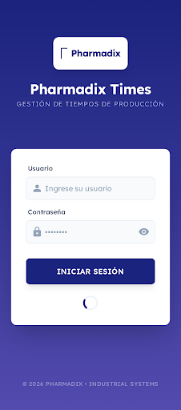 |
| **Registro de Operarios (Mobile)** | Lista de operarios con estados visuales y escaneo QR integrado. | 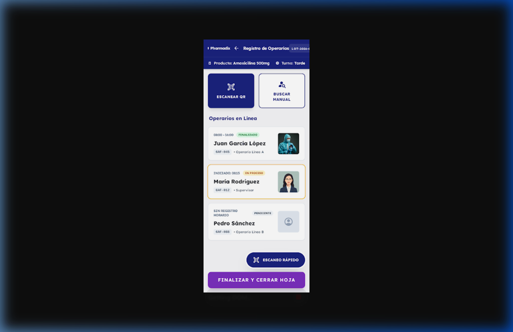 |
| **Registro de Operarios (Tablet Optimized)** | Versión optimizada para tablets en planta, con panel de estadísticas y búsqueda mejorada. | 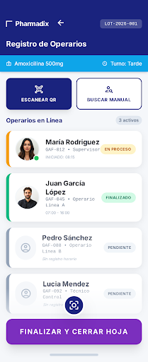 |

> **Nota:** El diseño final aplicado en el código XML (`fragment_registro_operarios.xml`) se basa estrictamente en la versión **Tablet Optimized** por ofrecer una mejor visualización de la información crítica en planta.

---

## 8. CONFIGURACIÓN DE DEPENDENCIAS – build.gradle.kts

### libs.versions.toml (versiones completas)

```toml
[versions]
agp = "9.0.1"
kotlin = "2.0.21"
ksp = "2.0.21-1.0.28"
coreKtx = "1.17.0"
appcompat = "1.7.1"
material = "1.13.0"
activity = "1.12.4"
constraintlayout = "2.2.1"
lifecycle = "2.9.0"
navigation = "2.8.9"
room = "2.7.0"
retrofit = "2.11.0"
okhttp = "4.12.0"
coroutines = "1.10.1"
zxing = "4.3.0"
junit = "4.13.2"
junitVersion = "1.3.0"
espressoCore = "3.7.0"

[libraries]
# Existentes
androidx-core-ktx = { group = "androidx.core", name = "core-ktx", version.ref = "coreKtx" }
androidx-appcompat = { group = "androidx.appcompat", name = "appcompat", version.ref = "appcompat" }
material = { group = "com.google.android.material", name = "material", version.ref = "material" }
androidx-activity = { group = "androidx.activity", name = "activity", version.ref = "activity" }
androidx-constraintlayout = { group = "androidx.constraintlayout", name = "constraintlayout", version.ref = "constraintlayout" }
# Lifecycle / ViewModel / LiveData
lifecycle-viewmodel-ktx = { group = "androidx.lifecycle", name = "lifecycle-viewmodel-ktx", version.ref = "lifecycle" }
lifecycle-livedata-ktx = { group = "androidx.lifecycle", name = "lifecycle-livedata-ktx", version.ref = "lifecycle" }
# Navigation (sin Compose)
navigation-fragment-ktx = { group = "androidx.navigation", name = "navigation-fragment-ktx", version.ref = "navigation" }
navigation-ui-ktx = { group = "androidx.navigation", name = "navigation-ui-ktx", version.ref = "navigation" }
# Room
room-runtime = { group = "androidx.room", name = "room-runtime", version.ref = "room" }
room-ktx = { group = "androidx.room", name = "room-ktx", version.ref = "room" }
room-compiler = { group = "androidx.room", name = "room-compiler", version.ref = "room" }
# Retrofit + OkHttp + Gson
retrofit = { group = "com.squareup.retrofit2", name = "retrofit", version.ref = "retrofit" }
retrofit-converter-gson = { group = "com.squareup.retrofit2", name = "converter-gson", version.ref = "retrofit" }
okhttp-logging = { group = "com.squareup.okhttp3", name = "logging-interceptor", version.ref = "okhttp" }
# Coroutines
kotlinx-coroutines-android = { group = "org.jetbrains.kotlinx", name = "kotlinx-coroutines-android", version.ref = "coroutines" }
# QR Scanner
zxing-android-embedded = { group = "com.journeyapps", name = "zxing-android-embedded", version.ref = "zxing" }
# Test
junit = { group = "junit", name = "junit", version.ref = "junit" }
androidx-junit = { group = "androidx.test.ext", name = "junit", version.ref = "junitVersion" }
androidx-espresso-core = { group = "androidx.test.espresso", name = "espresso-core", version.ref = "espressoCore" }

[plugins]
android-application = { id = "com.android.application", version.ref = "agp" }
kotlin-android = { id = "org.jetbrains.kotlin.android", version.ref = "kotlin" }
kotlin-ksp = { id = "com.google.devtools.ksp", version.ref = "ksp" }
```

### app/build.gradle.kts

```kotlin
plugins {
    alias(libs.plugins.android.application)
    alias(libs.plugins.kotlin.android)
    alias(libs.plugins.kotlin.ksp)
}

android {
    namespace = "com.example.android_app"
    compileSdk = 36

    defaultConfig {
        applicationId = "com.example.android_app"
        minSdk = 24
        targetSdk = 36
        versionCode = 1
        versionName = "1.0.0"
        testInstrumentationRunner = "androidx.test.runner.AndroidJUnitRunner"
    }

    buildFeatures {
        viewBinding = true
    }

    compileOptions {
        sourceCompatibility = JavaVersion.VERSION_11
        targetCompatibility = JavaVersion.VERSION_11
    }

    kotlinOptions {
        jvmTarget = "11"
    }
}

dependencies {
    // Core
    implementation(libs.androidx.core.ktx)
    implementation(libs.androidx.appcompat)
    implementation(libs.material)
    implementation(libs.androidx.activity)
    implementation(libs.androidx.constraintlayout)
    // ViewModel + LiveData
    implementation(libs.lifecycle.viewmodel.ktx)
    implementation(libs.lifecycle.livedata.ktx)
    // Navigation Component (sin Compose)
    implementation(libs.navigation.fragment.ktx)
    implementation(libs.navigation.ui.ktx)
    // Room (SQLite)
    implementation(libs.room.runtime)
    implementation(libs.room.ktx)
    ksp(libs.room.compiler)
    // Retrofit + OkHttp
    implementation(libs.retrofit)
    implementation(libs.retrofit.converter.gson)
    implementation(libs.okhttp.logging)
    // Coroutines
    implementation(libs.kotlinx.coroutines.android)
    // QR Scanner
    implementation(libs.zxing.android.embedded)
    // Tests
    testImplementation(libs.junit)
    androidTestImplementation(libs.androidx.junit)
    androidTestImplementation(libs.androidx.espresso.core)
}
```

---

## 9. CRONOGRAMA DE ACTIVIDADES

| Semana | Avance | Descripción | Entregables |
|---|---|---|---|
| 1-2 | Planificación | Análisis de requisitos, mockups, modelo de datos | Mockups, DER |
| 3 | Gradle + Room | Configuración de dependencias + entidades + DAOs | `libs.versions.toml`, `PharmadixDatabase.kt` |
| 4 | Login + Retrofit | LoginActivity XML + LoginViewModel + ApiService | `activity_login.xml`, `LoginActivity.kt` |
| 5 (**Avance 1**) | RecyclerView | RegistroOperariosFragment + Adapter + item XML | `RegistroOperarioAdapter.kt`, layouts |
| 6 | QR + Sync | Integración ZXing + sincronización REST | Flujo QR funcional |
| **7 (Final)** | Sustentación | Proyecto 100% + presentación | APK debug, informe completo |

---

## 10. CONCLUSIONES Y RECOMENDACIONES

### Conclusiones
1. La digitalización del control de tiempos elimina el riesgo de pérdida de datos y reduce el tiempo de registro de operarios en aproximadamente 60%.
2. El uso de Room como almacenamiento local garantiza la operación offline en planta, donde la conectividad puede ser intermitente.
3. La arquitectura MVVM adoptada sigue los patrones del manual de Cibertec y facilita el mantenimiento y extensión del código.
4. El cumplimiento de la norma ALCOA+ se logra mediante la auditoría automática de cada registro con timestamp, usuario y dispositivo.

### Recomendaciones
1. **Seguridad**: Implementar certificate pinning en OkHttp para evitar ataques man-in-the-middle en entornos de producción.
2. **Escalabilidad**: Considerar WorkManager de Jetpack para la sincronización en segundo plano en versiones futuras.
3. **Cobertura**: Mantener `minSdk = 24` para soportar dispositivos Android 7.0+ en planta que pueden ser más antiguos.
4. **Testing**: Añadir pruebas unitarias a ViewModels con MockK y pruebas de integración para los DAOs de Room.

---

## 11. GLOSARIO

| Término | Definición |
|---|---|
| **ALCOA+** | Atribuible, Legible, Contemporáneo, Original, Exacto + Completo, Consistente, Enduring, Disponible. Norma de trazabilidad farmacéutica. |
| **DAO** | Data Access Object. Interfaz de acceso a la base de datos en Room. |
| **Gafete** | Identificador físico del operario con código QR impreso. |
| **Hoja de Tiempo** | Documento digital que agrupa los registros de tiempo de un turno/lote. |
| **Lote** | Unidad de producción farmacéutica con número único. |
| **MVVM** | Model-View-ViewModel. Patrón arquitectónico para separar UI de lógica de negocio. |
| **MVP** | Mínimo Producto Viable. Primera versión funcional del sistema. |
| **RecyclerView** | Componente Android para mostrar listas eficientes con reciclaje de vistas. |
| **REST** | Representational State Transfer. Estilo de arquitectura para servicios web. |
| **Room** | Librería de Jetpack que abstrae SQLite en Android con mapeo objeto-relacional. |
| **Tomador de Tiempos** | Usuario encargado de registrar los tiempos de producción de los operarios. |
| **View Binding** | Característica Android que genera clases de enlace para acceder a vistas XML de forma segura. |

---

## 12. BIBLIOGRAFÍA

- Android Developers. (2024). *Room Persistence Library*. https://developer.android.com/training/data-storage/room
- Android Developers. (2024). *Guide to App Architecture (MVVM)*. https://developer.android.com/topic/architecture
- Android Developers. (2024). *RecyclerView for displaying lists of data*. https://developer.android.com/develop/ui/views/layout/recyclerview
- Android Developers. (2024). *Material Design 3 for Android*. https://m3.material.io/develop/android/jetpack-compose
- Square, Inc. (2024). *Retrofit 2 – A type-safe HTTP client for Android*. https://square.github.io/retrofit/
- Google. (2024). *ZXing Android Embedded*. https://github.com/journeyapps/zxing-android-embedded
- Cibertec. (2026). *Plan de Proyecto de Investigación Aplicada – Desarrollo de Aplicaciones Móviles I (4693)*. Instituto de Educación Superior Cibertec.

---

## ANEXOS

### Anexo A – Rúbrica de Calificación (Fuente: Guía de Proyecto Cibertec)

#### Calificación del Informe (60% de la nota final – 20 puntos)

| Criterio | Puntaje | Cobertura en este proyecto |
|---|---|---|
| Diagnóstico SEPTE | 2 pts | ✅ Sección 4.1 – análisis Social, Económico, Político-Legal, Tecnológico, Ecológico |
| Objetivos y Justificación | 4 pts | ✅ Sección 3 (SMART) + Sección 4 (beneficiarios) |
| Layouts Android | 2 pts | ✅ `activity_login.xml`, `fragment_registro_operarios.xml`, `item_registro_operario.xml` |
| Manejo de Listas (RecyclerView) | 2 pts | ✅ `RegistroOperarioAdapter` con ViewHolder pattern |
| Manejo de SQLite | 4 pts | ✅ CRUD completo: 5 entidades Room + 5 DAOs |
| Consumo de Servicios Web | 4 pts | ✅ 5 endpoints REST con Retrofit (login, hojas, registros) |
| Aspectos Formales | 2 pts | ✅ Formato Cibertec, ortografía en español |
| **TOTAL** | **20 pts** | |

#### Calificación de la Sustentación (40% de la nota final)

| Criterio | Puntaje | Preparación sugerida |
|---|---|---|
| Presentación (puntualidad, vestimenta, dominio) | 3 pts | Organizar una demo en vivo de la app |
| Organización (esquema, orden secuencial) | 4 pts | Seguir el orden de este informe |
| Contenido (objetivos, resultados, conclusiones) | 6 pts | Enfatizar la solución del problema ALCOA+ |
| Aplicación/Demostración (prototipo funcionando) | 7 pts | Demo con escaneo QR real en emulador o dispositivo |

### Anexo B – Screenshots de la PWA (referencia de diseño)

> *(Adjuntar capturas de pantalla de la PWA actual como referencia visual para los mockups Android)*

### Anexo C – Diagramas de Flujo del Sistema (Pharmadix Times TO-BE)

> Fuente: `Documentacion_Realizada/Flujo_Procesos_Pharmadix.md`

#### Actores y Sistemas

- **Tomador de Tiempos:** Operario encargado de registrar los tiempos de su equipo (10-20 personas).
- **App Android:** Aplicación nativa Pharmadix Times (Kotlin + XML Views).
- **Room/SQLite:** Almacenamiento local para operación offline.
- **Backend API:** API de alto rendimiento (Fastify/Node.js).
- **Base de Datos:** PostgreSQL 15+.

---

#### C.1 Flujo de Inicio de Sesión e Ingreso de Lote

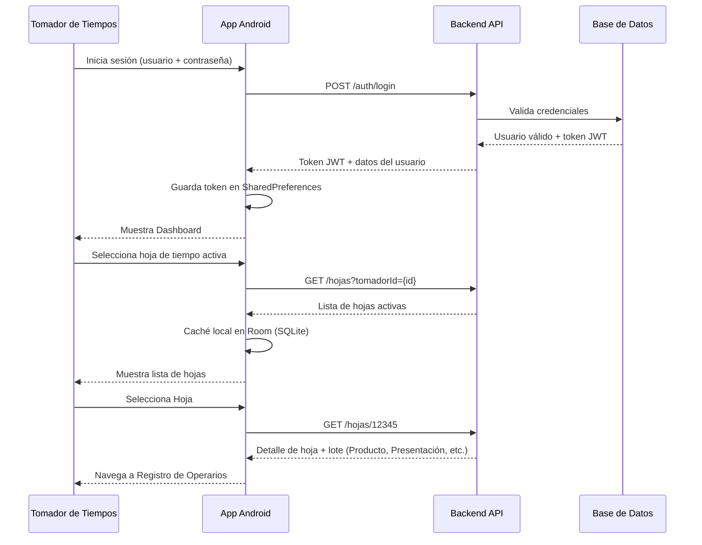

---

#### C.2 Registro Masivo con Validación de Estado (Flujo Principal del MVP)

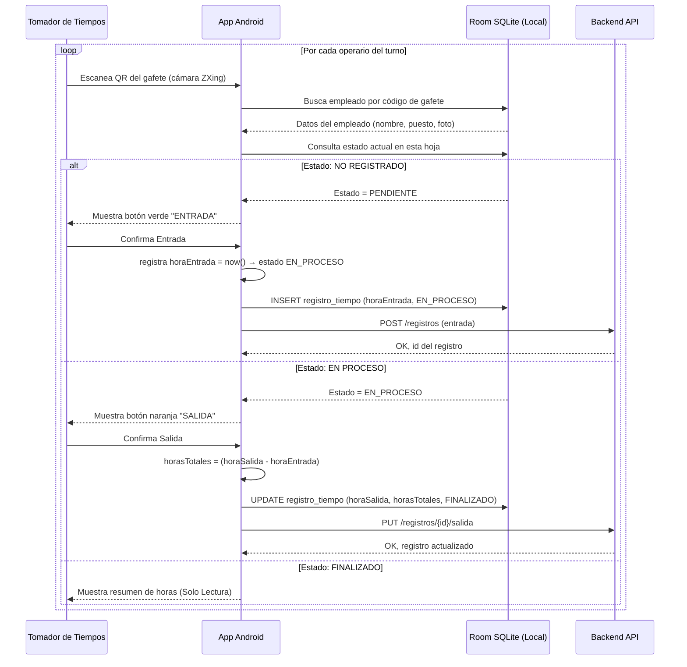

---

#### C.3 Cierre de Hoja con Doble Confirmación

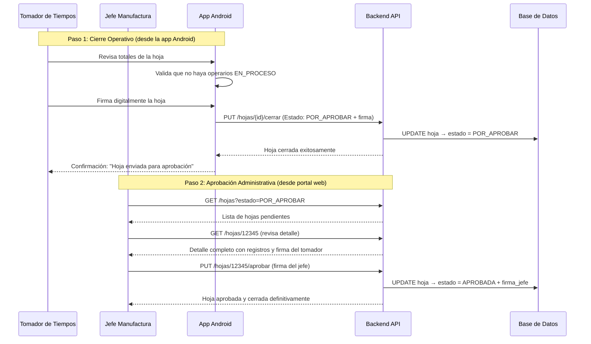

---

#### C.4 Flujo de Datos Online vs Offline

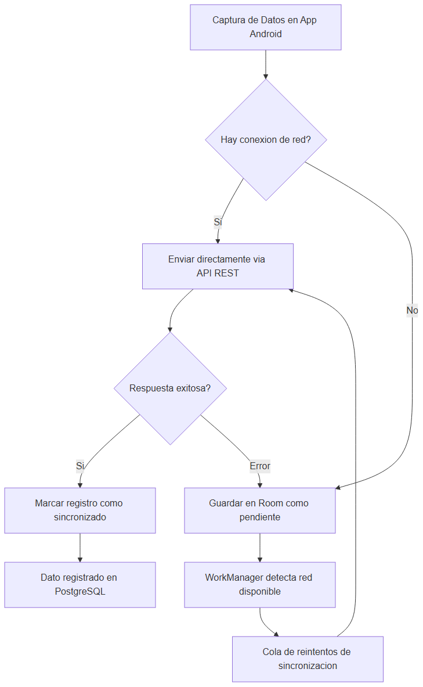

<details><summary>Fuente Mermaid</summary>

```
graph TD
    A[Captura de Datos en App Android] --> B{Hay conexion de red?}
    B -- Si --> C[Enviar directamente via API REST]
    C --> D{Respuesta exitosa?}
    D -- Si --> E[Marcar registro como sincronizado]
    D -- Error --> F[Guardar en Room como pendiente]
    B -- No --> F
    F --> G[WorkManager detecta red disponible]
    G --> H[Cola de reintentos de sincronizacion]
    H --> C
    E --> I[Dato registrado en PostgreSQL]
```

</details>

---

#### C.5 Arquitectura Completa del Sistema

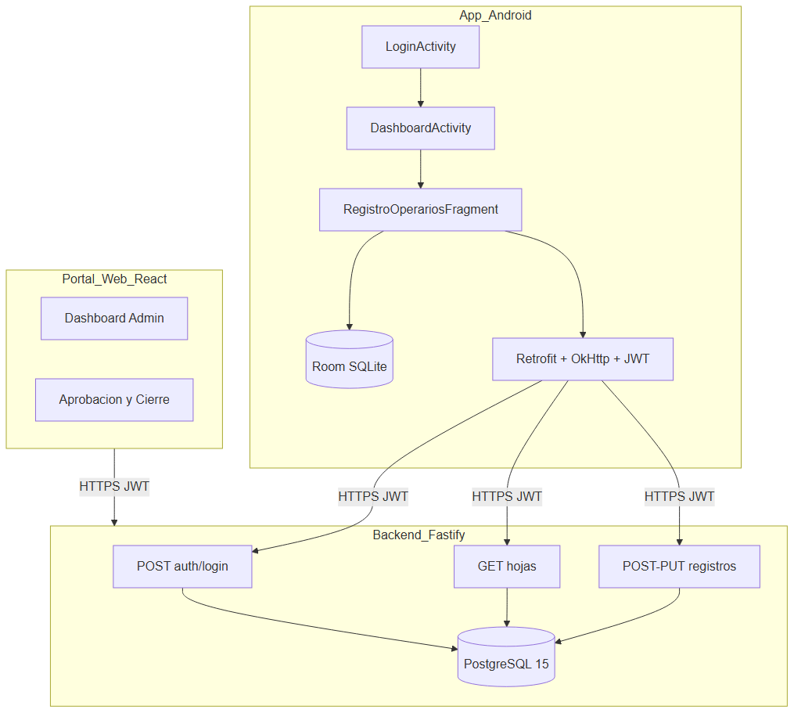

<details><summary>Fuente Mermaid</summary>

```
graph TB
    subgraph App_Android
        Login[LoginActivity]
        Dashboard[DashboardActivity]
        Registro[RegistroOperariosFragment]
        RoomDB[(Room SQLite)]
        RetrofitC[Retrofit + OkHttp + JWT]
    end
    subgraph Backend_Fastify
        AuthEP[POST auth/login]
        HojasEP[GET hojas]
        RegistrosEP[POST-PUT registros]
        PostgreDB[(PostgreSQL 15)]
    end
    subgraph Portal_Web_React
        DashboardWeb[Dashboard Admin]
        Aprobacion[Aprobacion y Cierre]
    end
    Login --> Dashboard
    Dashboard --> Registro
    Registro --> RoomDB
    Registro --> RetrofitC
    RetrofitC -->|HTTPS JWT| AuthEP
    RetrofitC -->|HTTPS JWT| HojasEP
    RetrofitC -->|HTTPS JWT| RegistrosEP
    AuthEP --> PostgreDB
    HojasEP --> PostgreDB
    RegistrosEP --> PostgreDB
    Portal_Web_React -->|HTTPS JWT| Backend_Fastify
```

</details>

---

#### C.6 Máquina de Estados del Registro de Tiempo (ALCOA+)

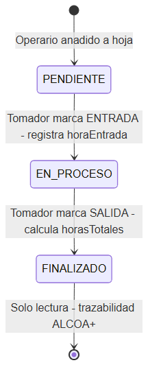

<details><summary>Fuente Mermaid</summary>

```
stateDiagram
    [*] --> PENDIENTE : Operario anadido a hoja
    PENDIENTE --> EN_PROCESO : Tomador marca ENTRADA - registra horaEntrada
    EN_PROCESO --> FINALIZADO : Tomador marca SALIDA - calcula horasTotales
    FINALIZADO --> [*] : Solo lectura - trazabilidad ALCOA+
```

</details>

---

*Documento generado el 27 de Febrero, 2026*  
*Pharmadix Times – Cibertec Desarrollo de Aplicaciones Móviles I (4693)*

---

## D. Diseño de Interfaces – Mockups (Stitch)

Los siguientes mockups fueron diseñados con **Google Stitch** siguiendo los principios de **Material Design 3** y la identidad visual corporativa de Pharmadix (azul marino `#1A237E` + degradado a `#534BAE`).

### D.1 Pantalla de Login – `LoginActivity`

> **Flujo:** App launch → `LoginActivity` → Validación JWT → `DashboardActivity`


| Componente UI | Tipo | Descripción |
|---|---|---|
| Logo Pharmadix | `ImageView` (PNG) | Logo oficial en card blanca 160×72dp |
| Título "Pharmadix Times" | `TextView` | 28sp bold, color blanco |
| Subtítulo | `TextView` | 14sp, semitransparente |
| Campo Usuario | `TextInputLayout` (Material3) | Ícono `ic_person`, hint "Usuario" |
| Campo Contraseña | `TextInputLayout` (Material3) | Ícono `ic_lock`, toggle visibilidad |
| Botón Iniciar Sesión | `MaterialButton` | 56dp altura, `#1A237E`, esquinas 12dp |
| ProgressBar | `ProgressBar` | Visible durante llamada a API |

---

### D.2 Pantalla de Registro de Operarios – `RegistroOperariosFragment`

> **Flujo:** `DashboardActivity` → NavComponent → `RegistroOperariosFragment`


| Componente UI | Tipo | Descripción |
|---|---|---|
| Toolbar | `MaterialToolbar` | Logo Pharmadix + título + chip número de lote |
| Info Bar | `LinearLayout` | Producto del lote + Turno activo |
| Botón ESCANEAR QR | `MaterialButton` (outlined) | Lanza ZXing `ScanContract` |
| Botón BUSCAR MANUAL | `MaterialButton` (outlined) | Búsqueda por nombre/ID |
| Lista Operarios | `RecyclerView` | `RegistroOperarioAdapter` con 3 estados |
| Item – FINALIZADO | `Chip` verde `#388E3C` | Operario con hora entrada y salida |
| Item – EN PROCESO | `Chip` naranja `#F57C00` | Operario con hora de entrada activa |
| Item – PENDIENTE | `Chip` gris `#9E9E9E` | Sin registro de tiempo |
| FAB ESCANEO RÁPIDO | `FloatingActionButton` | Azul marino, ícono QR |
| Botón FINALIZAR HOJA | `MaterialButton` | Morado `#7B2FBE`, ancho completo |

#### Máquina de Estados del RecyclerView

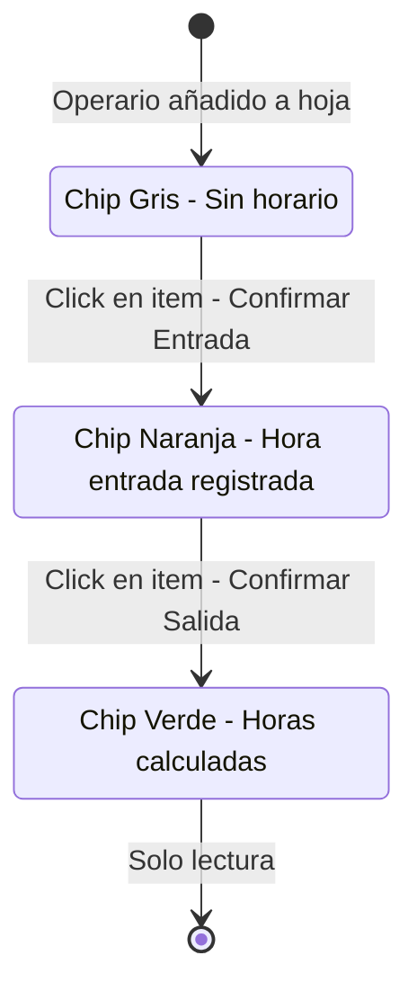

---

## E. Modelo de Base de Datos

### E.1 Diagrama Entidad-Relación (Modelo Lógico)

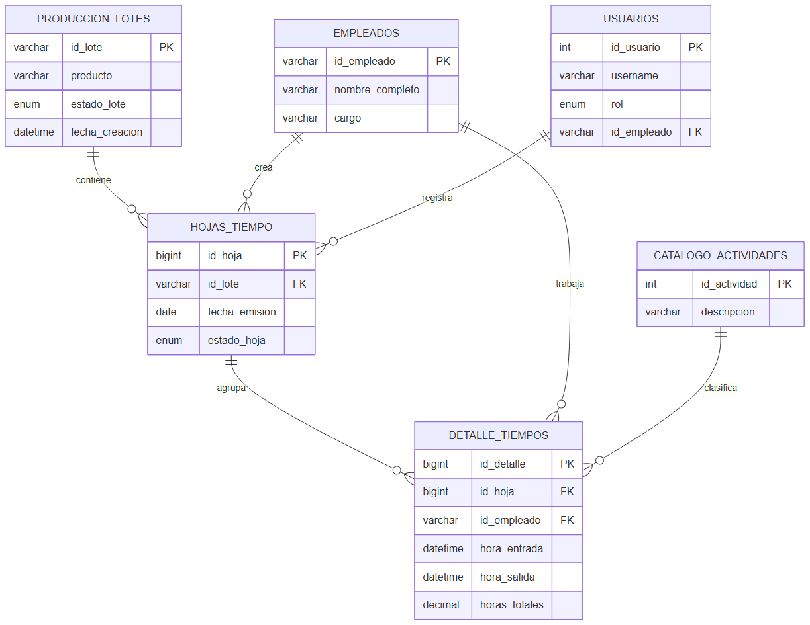

<details><summary>Fuente Mermaid</summary>

```
erDiagram
    PRODUCCION_LOTES ||--o{ HOJAS_TIEMPO : contiene
    HOJAS_TIEMPO ||--o{ DETALLE_TIEMPOS : agrupa
    EMPLEADOS ||--o{ HOJAS_TIEMPO : crea
    EMPLEADOS ||--o{ DETALLE_TIEMPOS : trabaja
    CATALOGO_ACTIVIDADES ||--o{ DETALLE_TIEMPOS : clasifica
    USUARIOS ||--o{ HOJAS_TIEMPO : registra

    PRODUCCION_LOTES {
        varchar id_lote PK
        varchar producto
        enum estado_lote
        datetime fecha_creacion
    }
    EMPLEADOS {
        varchar id_empleado PK
        varchar nombre_completo
        varchar cargo
    }
    USUARIOS {
        int id_usuario PK
        varchar username
        enum rol
        varchar id_empleado FK
    }
    HOJAS_TIEMPO {
        bigint id_hoja PK
        varchar id_lote FK
        date fecha_emision
        enum estado_hoja
    }
    DETALLE_TIEMPOS {
        bigint id_detalle PK
        bigint id_hoja FK
        varchar id_empleado FK
        datetime hora_entrada
        datetime hora_salida
        decimal horas_totales
    }
    CATALOGO_ACTIVIDADES {
        int id_actividad PK
        varchar descripcion
    }
```

</details>

### E.2 Modelo Físico – Tablas Maestras

#### PRODUCCION_LOTES
**Propósito**: Catálogo de lotes de producción farmacéutica.

| Campo | Tipo | Restricciones | Descripción |
|---|---|---|---|
| `id_lote` | `VARCHAR(50)` | PK, NOT NULL | Número de lote (ej: `LOT-2026-001`) |
| `producto` | `VARCHAR(200)` | NOT NULL | Nombre del producto (ej: `Amoxicilina 500mg`) |
| `presentacion` | `VARCHAR(100)` | NOT NULL | Presentación (ej: `Frasco 500ml`) |
| `cantidad_ordenada` | `INT` | NOT NULL | Unidades a producir |
| `estado_lote` | `ENUM` | `'ABIERTO','CERRADO'` | Estado actual del lote |
| `fecha_creacion` | `TIMESTAMP` | `DEFAULT NOW()` | Registro de creación |

#### EMPLEADOS
**Propósito**: Catálogo de trabajadores de la planta.

| Campo | Tipo | Restricciones | Descripción |
|---|---|---|---|
| `id_empleado` | `VARCHAR(50)` | PK, NOT NULL | Número de gafete/nómina |
| `nombre_completo` | `VARCHAR(200)` | NOT NULL | Nombre del empleado |
| `cargo` | `VARCHAR(100)` | NULL | Puesto de trabajo |
| `activo` | `BOOLEAN` | `DEFAULT TRUE` | Estado del empleado |

#### CATALOGO_ACTIVIDADES
**Propósito**: Lista de actividades productivas aprobadas.

| Campo | Tipo | Restricciones | Descripción |
|---|---|---|---|
| `id_actividad` | `SERIAL` | PK | ID autogenerado |
| `descripcion` | `VARCHAR(200)` | NOT NULL, UNIQUE | Ej: `"Etiquetado"`, `"Envasado"` |
| `tipo` | `VARCHAR(50)` | NULL | Productiva / Mantenimiento / Inspección |

#### USUARIOS
**Propósito**: Cuentas de acceso al sistema (Tomadores de Tiempo y Jefes de Manufactura).

| Campo | Tipo | Restricciones | Descripción |
|---|---|---|---|
| `id_usuario` | `SERIAL` | PK | ID autogenerado |
| `username` | `VARCHAR(100)` | NOT NULL, UNIQUE | Nombre de usuario |
| `password_hash` | `VARCHAR(255)` | NOT NULL | Hash bcrypt |
| `rol` | `ENUM` | `'TOMADOR','JEFE','ADMIN'` | Rol en el sistema |
| `id_empleado` | `VARCHAR(50)` | FK, NULL | Vínculo con catálogo EMPLEADOS |

---

### E.3 Modelo Físico – Tablas Transaccionales

#### HOJAS_TIEMPO
**Propósito**: Hoja digital de tiempo — agrupa los registros por lote/turno.

| Campo | Tipo | Restricciones | Descripción |
|---|---|---|---|
| `id_hoja` | `BIGSERIAL` | PK | ID consecutivo automático |
| `numero_fisico_ref` | `VARCHAR(50)` | NULL | Número del talonario físico (referencia) |
| `id_lote` | `VARCHAR(50)` | FK NOT NULL | Lote al que pertenece |
| `fecha_emision` | `DATE` | NOT NULL | Fecha del turno |
| `area` | `VARCHAR(100)` | NULL | Área de producción |
| `proceso` | `VARCHAR(100)` | NULL | Proceso específico |
| `fecha_inicio_hoja` | `TIMESTAMP` | `DEFAULT NOW()` | Apertura de la hoja |
| `fecha_cierre_hoja` | `TIMESTAMP` | NULL | Cierre/firma de la hoja |
| `id_tomador_tiempos` | `VARCHAR(50)` | FK NOT NULL | Quién creó la hoja |
| `id_jefe_manufactura` | `VARCHAR(50)` | FK NULL | Quién aprobó la hoja |
| `observaciones` | `TEXT` | NULL | Notas generales |
| `estado_hoja` | `ENUM` | `'BORRADOR','ENVIADA','APROBADA'` | Estado en flujo de aprobación |

**Índices:** `idx_lote`, `idx_estado_hoja`, `idx_fecha_emision`

#### DETALLE_TIEMPOS
**Propósito**: Un renglón por cada operario/actividad dentro de una hoja.

| Campo | Tipo | Restricciones | Descripción |
|---|---|---|---|
| `id_detalle` | `BIGSERIAL` | PK | ID único del renglón |
| `id_hoja` | `BIGINT` | FK NOT NULL | Hoja a la que pertenece |
| `id_empleado` | `VARCHAR(50)` | FK NOT NULL | Operario |
| `id_actividad` | `INT` | FK NOT NULL | Actividad realizada |
| `turno` | `ENUM` | `'MAÑANA','TARDE','NOCHE'` | Turno de trabajo |
| `hora_entrada` | `TIMESTAMP` | NOT NULL | Inicio de actividad |
| `hora_salida` | `TIMESTAMP` | NOT NULL | Fin de actividad |
| `horas_totales` | `DECIMAL(5,2)` | NOT NULL | Calculado: salida − entrada |
| `cantidad_producida` | `INT` | NULL | Unidades producidas (opcional) |

**Índices:** `idx_hoja`, `idx_empleado`, `idx_actividad`

---

### E.4 Script DDL – PostgreSQL

```sql
-- ============================================================
-- Pharmadix Times – DDL PostgreSQL
-- Sistema de Gestión de Tiempos de Producción Farmacéutica
-- ============================================================

-- TABLAS MAESTRAS
CREATE TABLE produccion_lotes (
    id_lote         VARCHAR(50)  PRIMARY KEY,
    producto        VARCHAR(200) NOT NULL,
    presentacion    VARCHAR(100) NOT NULL,
    cantidad_ordenada INT        NOT NULL,
    estado_lote     VARCHAR(10)  NOT NULL DEFAULT 'ABIERTO'
                    CHECK (estado_lote IN ('ABIERTO','CERRADO')),
    fecha_creacion  TIMESTAMP    DEFAULT CURRENT_TIMESTAMP
);
CREATE INDEX idx_estado_lote ON produccion_lotes(estado_lote);

CREATE TABLE empleados (
    id_empleado     VARCHAR(50)  PRIMARY KEY,
    nombre_completo VARCHAR(200) NOT NULL,
    cargo           VARCHAR(100),
    activo          BOOLEAN      DEFAULT TRUE
);
CREATE INDEX idx_nombre_empleado ON empleados(nombre_completo);

CREATE TABLE catalogo_actividades (
    id_actividad    SERIAL       PRIMARY KEY,
    descripcion     VARCHAR(200) NOT NULL UNIQUE,
    tipo            VARCHAR(50)
);

CREATE TABLE usuarios (
    id_usuario      SERIAL       PRIMARY KEY,
    username        VARCHAR(100) NOT NULL UNIQUE,
    password_hash   VARCHAR(255) NOT NULL,
    rol             VARCHAR(20)  NOT NULL DEFAULT 'TOMADOR'
                    CHECK (rol IN ('TOMADOR','JEFE','ADMIN')),
    id_empleado     VARCHAR(50)  REFERENCES empleados(id_empleado)
);

-- TABLAS TRANSACCIONALES
CREATE TABLE hojas_tiempo (
    id_hoja              BIGSERIAL    PRIMARY KEY,
    numero_fisico_ref    VARCHAR(50),
    id_lote              VARCHAR(50)  NOT NULL REFERENCES produccion_lotes(id_lote),
    fecha_emision        DATE         NOT NULL,
    area                 VARCHAR(100),
    proceso              VARCHAR(100),
    fecha_inicio_hoja    TIMESTAMP    DEFAULT CURRENT_TIMESTAMP,
    fecha_cierre_hoja    TIMESTAMP,
    id_tomador_tiempos   VARCHAR(50)  NOT NULL REFERENCES empleados(id_empleado),
    id_jefe_manufactura  VARCHAR(50)  REFERENCES empleados(id_empleado),
    observaciones        TEXT,
    estado_hoja          VARCHAR(10)  NOT NULL DEFAULT 'BORRADOR'
                         CHECK (estado_hoja IN ('BORRADOR','ENVIADA','APROBADA'))
);
CREATE INDEX idx_lote ON hojas_tiempo(id_lote);
CREATE INDEX idx_estado_hoja ON hojas_tiempo(estado_hoja);
CREATE INDEX idx_fecha_emision ON hojas_tiempo(fecha_emision);

CREATE TABLE detalle_tiempos (
    id_detalle          BIGSERIAL    PRIMARY KEY,
    id_hoja             BIGINT       NOT NULL REFERENCES hojas_tiempo(id_hoja) ON DELETE CASCADE,
    id_empleado         VARCHAR(50)  NOT NULL REFERENCES empleados(id_empleado),
    id_actividad        INT          NOT NULL REFERENCES catalogo_actividades(id_actividad),
    turno               VARCHAR(7)   CHECK (turno IN ('MAÑANA','TARDE','NOCHE')),
    hora_entrada        TIMESTAMP    NOT NULL,
    hora_salida         TIMESTAMP    NOT NULL,
    horas_totales       DECIMAL(5,2) NOT NULL DEFAULT 0,
    cantidad_producida  INT
);
CREATE INDEX idx_dt_hoja      ON detalle_tiempos(id_hoja);
CREATE INDEX idx_dt_empleado  ON detalle_tiempos(id_empleado);
CREATE INDEX idx_dt_actividad ON detalle_tiempos(id_actividad);

-- REGLA RN-002: Cálculo automático de horas (Trigger)
CREATE OR REPLACE FUNCTION fn_calcular_horas()
RETURNS TRIGGER AS $$
BEGIN
    NEW.horas_totales := EXTRACT(EPOCH FROM (NEW.hora_salida - NEW.hora_entrada)) / 3600.0;
    RETURN NEW;
END;
$$ LANGUAGE plpgsql;

CREATE TRIGGER trg_calcular_horas
BEFORE INSERT OR UPDATE ON detalle_tiempos
FOR EACH ROW EXECUTE FUNCTION fn_calcular_horas();

-- DATOS INICIALES
INSERT INTO catalogo_actividades (descripcion, tipo) VALUES
    ('Etiquetado',          'Productiva'),
    ('Envasado',            'Productiva'),
    ('Llenado Aséptico',    'Productiva'),
    ('Limpieza de Equipo',  'Mantenimiento'),
    ('Control de Calidad',  'Inspección'),
    ('Granulación',         'Productiva');
```

---

## F. Documentación Funcional

### F.1 Casos de Uso

#### CU-01: Autenticación de Usuario

| Campo | Detalle |
|---|---|
| **Actor** | Tomador de Tiempos / Jefe de Manufactura |
| **Precondición** | Usuario registrado en tabla `USUARIOS` |
| **Flujo Normal** | 1. Usuario ingresa credenciales → 2. App llama `POST /auth/login` → 3. Backend valida y devuelve JWT → 4. App almacena JWT y navega a `DashboardActivity` |
| **Flujo Alternativo** | Credenciales inválidas → muestra error en campo, no avanza |
| **Postcondición** | Token JWT almacenado en `SharedPreferences` |

#### CU-02: Crear Hoja de Tiempo (Escaneo QR de Lote)

| Campo | Detalle |
|---|---|
| **Actor** | Tomador de Tiempos |
| **Precondición** | Usuario autenticado, lote en estado `ABIERTO` |
| **Flujo Normal** | 1. Tomador escanea QR del lote → 2. App llama `GET /lotes/{id}` → 3. Backend devuelve datos del lote → 4. App crea hoja en Room con estado `BORRADOR` |
| **Flujo Alternativo** | Lote `CERRADO` → error "No se puede registrar en lote cerrado" |
| **Postcondición** | Registro en `HOJAS_TIEMPO` estado `BORRADOR` |

#### CU-03: Registrar Entrada/Salida de Operario

| Campo | Detalle |
|---|---|
| **Actor** | Tomador de Tiempos |
| **Precondición** | Hoja en estado `BORRADOR`, operario en estado `PENDIENTE` |
| **Flujo Normal** | 1. Escanea gafete del operario → 2. App verifica estado en Room → 3. Si PENDIENTE: muestra diálogo "Confirmar Entrada" → 4. Guarda en Room + sincroniza `POST /registros` → 5. Chip cambia a EN_PROCESO |
| **Flujo Alternativo** | Si EN_PROCESO: muestra diálogo "Confirmar Salida" → calcula horas → estado FINALIZADO |
| **Postcondición** | Registro en `DETALLE_TIEMPOS` con `horas_totales` calculado |

#### CU-04: Cerrar y Firmar Hoja

| Campo | Detalle |
|---|---|
| **Actor** | Tomador de Tiempos |
| **Precondición** | Hoja `BORRADOR`, sin operarios en estado `EN_PROCESO` |
| **Flujo Normal** | 1. Click "Finalizar y Cerrar Hoja" → 2. Validación de que no hay EN_PROCESO → 3. Muestra resumen → 4. Llamada `PUT /hojas/{id}/cerrar` → 5. Estado → `ENVIADA` |
| **Flujo Alternativo** | Hay operarios EN_PROCESO → muestra lista de pendientes, no permite cerrar |
| **Postcondición** | `HOJAS_TIEMPO.estado_hoja = 'ENVIADA'`, visible en portal admin |

#### CU-05: Portal Admin – Aprobar Hoja

| Campo | Detalle |
|---|---|
| **Actor** | Jefe de Manufactura (portal web) |
| **Precondición** | Hoja en estado `ENVIADA` |
| **Flujo Normal** | 1. Jefe ingresa al portal → 2. Ve lista de hojas `POR_APROBAR` → 3. Revisa detalle → 4. Aprueba → `PUT /hojas/{id}/aprobar` → 5. Estado → `APROBADA` |
| **Postcondición** | `HOJAS_TIEMPO.estado_hoja = 'APROBADA'`, genera reporte de costos |

---

### F.2 Requisitos Funcionales

| ID | Requisito | Actor | Prioridad |
|---|---|---|---|
| RF-001 | El sistema debe permitir autenticar usuarios con usuario/contraseña y devolver JWT | Sistema | Must Have |
| RF-002 | El sistema debe crear hojas de tiempo vinculadas a un lote por QR | Tomador | Must Have |
| RF-003 | El sistema debe registrar hora de entrada y salida de cada operario | Tomador | Must Have |
| RF-004 | El sistema debe calcular `horas_totales` automáticamente al registrar salida | Sistema | Must Have |
| RF-005 | El sistema debe permitir cerrar y firmar hojas validando que no haya EN_PROCESO | Tomador | Must Have |
| RF-006 | El portal web debe permitir al Jefe aprobar hojas enviadas | Jefe | Must Have |
| RF-007 | La app debe funcionar sin conexión y sincronizar al recuperar red | Sistema | Should Have |
| RF-008 | El sistema debe generar reportes de horas y costos por lote | Admin | Should Have |

---

### F.3 Requisitos No Funcionales

| ID | Categoría | Requisito |
|---|---|---|
| RNF-001 | **Rendimiento** | Soportar 50 transacciones/segundo, latencia < 200ms |
| RNF-002 | **Disponibilidad Offline** | Arquitectura Offline-First: Room + WorkManager para sincronización |
| RNF-003 | **Auditoría ALCOA+** | Trazabilidad completa: quién, cuándo y qué se registró. Registros cerrados son inmutables |
| RNF-004 | **Usabilidad** | UX simplificado para operarios: botones grandes, mínimo 2 clics por acción |
| RNF-005 | **Seguridad** | JWT con expiración, bcrypt para contraseñas, HTTPS en todas las llamadas |
| RNF-006 | **Escalabilidad** | Soporte para 100 usuarios concurrentes sin degradación de rendimiento |

---

### F.4 Reglas de Negocio

#### RN-01: Validación de Lote Activo
> No se puede crear ni registrar en un lote con estado `CERRADO`.  
> **Implementación:** Validación en backend antes de INSERT en `HOJAS_TIEMPO`.

#### RN-02: Cálculo Automático de Horas
> `horas_totales = hora_salida − hora_entrada` en horas decimales (ej: 1.5 h).  
> **Implementación:** Trigger `trg_calcular_horas` en PostgreSQL + lógica duplicada en `RegistroRepository.kt`.

#### RN-03: Inmutabilidad de Hojas Cerradas
> Una hoja en estado `ENVIADA` o `APROBADA` no puede ser modificada ni eliminada.  
> **Implementación:** Trigger `trg_validar_hoja_cerrada` + validación en endpoint REST.

#### RN-04: Aprobación por Bloque
> El Jefe de Manufactura aprueba la hoja completa. No se aprueba por renglón individual.  
> **Implementación:** Endpoint `PUT /hojas/{id}/aprobar` actualiza `estado_hoja` y registra `id_jefe_manufactura` + `timestamp`.

#### RN-05: Un Registro por Operario por Hoja
> Un operario no puede tener dos registros activos en la misma hoja simultáneamente.  
> **Implementación:** Consulta en `RegistroRepository: obtenerPorEmpleadoYHoja()` antes de crear entrada.

---

### F.5 Flujo Completo de la Aplicación

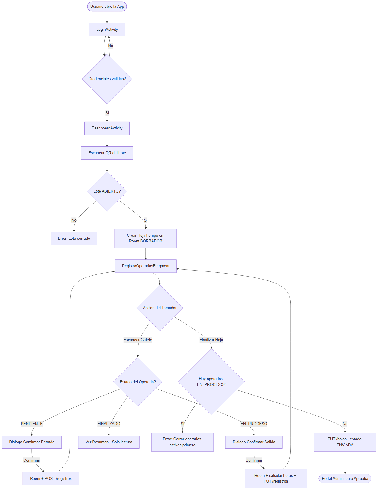

<details><summary>Fuente Mermaid</summary>

```
graph TD
    A([Usuario abre la App]) --> B[LoginActivity]
    B --> C{Credenciales validas?}
    C -- No --> B
    C -- Si --> D[DashboardActivity]
    D --> E[Escanear QR del Lote]
    E --> F{Lote ABIERTO?}
    F -- No --> G[Error: Lote cerrado]
    F -- Si --> H[Crear HojaTiempo en Room BORRADOR]
    H --> I[RegistroOperariosFragment]
    I --> J{Accion del Tomador}
    J -- Escanear Gafete --> K{Estado del Operario?}
    K -- PENDIENTE --> L[Dialogo Confirmar Entrada]
    K -- EN_PROCESO --> M[Dialogo Confirmar Salida]
    K -- FINALIZADO --> N[Ver Resumen - Solo lectura]
    L -- Confirmar --> O[Room + POST registros]
    M -- Confirmar --> P[Room + calcular horas + PUT registros]
    O --> I
    P --> I
    J -- Finalizar Hoja --> Q{Hay operarios EN_PROCESO?}
    Q -- Si --> R[Error: Cerrar operarios activos primero]
    Q -- No --> S[PUT hojas - estado ENVIADA]
    S --> T([Portal Admin: Jefe Aprueba])
```

</details>

---

## G. Aplicación Web – Portal Administrativo

### G.1 Descripción General

El **Portal Administrativo Pharmadix Times** es una Progressive Web App (PWA) desarrollada en **React + Vite + Tailwind CSS**, desplegada en el mismo servidor que el backend Fastify. Permite a los Jefes de Manufactura y Administradores gestionar el flujo completo de aprobación de hojas de tiempo.

**URL de acceso:** `https://[dominio-backend]/admin`  
**Autenticación:** JWT con rol `'JEFE'` o `'ADMIN'`

### G.2 Módulos del Portal

| Módulo | Ruta | Descripción |
|---|---|---|
| **Dashboard** | `/admin` | KPIs de horas por lote, operarios activos, hojas pendientes |
| **Hojas Pendientes** | `/admin/hojas` | Lista de hojas en estado `ENVIADA` para aprobar |
| **Detalle de Hoja** | `/admin/hojas/{id}` | Vista completa de renglones, horas y firmas |
| **Catálogo de Empleados** | `/admin/empleados` | CRUD de operarios (alta, baja, edición) |
| **Catálogo de Lotes** | `/admin/lotes` | CRUD de lotes y cambio de estado ABIERTO/CERRADO |
| **Catálogo de Actividades** | `/admin/actividades` | CRUD de actividades productivas del catálogo |
| **Reportes** | `/admin/reportes` | Reporte de horas y costos por lote, área, período |

### G.3 Stack Tecnológico del Portal

```
Frontend (PWA):  React 18 + Vite 5 + Tailwind CSS 3
Iconos:          Heroicons / Lucide-React
Routing:         React Router v6
HTTP Client:     Axios con interceptor JWT
Estado global:   Zustand
```

### G.4 Integración con Backend REST

| Endpoint | Método | Rol Requerido | Descripción |
|---|---|---|---|
| `/auth/login` | POST | Público | Autenticación, devuelve JWT |
| `/hojas` | GET | TOMADOR, JEFE | Listar hojas (con filtros estado, fecha) |
| `/hojas/{id}` | GET | TOMADOR, JEFE | Detalle de hoja con renglones |
| `/hojas/{id}/cerrar` | PUT | TOMADOR | Cambiar estado a ENVIADA |
| `/hojas/{id}/aprobar` | PUT | JEFE | Cambiar estado a APROBADA |
| `/registros` | POST | TOMADOR | Crear registro de tiempo (entrada) |
| `/registros/{id}` | PUT | TOMADOR | Actualizar registro (salida) |
| `/empleados` | GET/POST/PUT | ADMIN | CRUD catálogo de empleados |
| `/lotes` | GET/POST/PUT | ADMIN | CRUD catálogo de lotes |
| `/actividades` | GET | TOMADOR | Listar catálogo de actividades |
| `/reportes/horas` | GET | JEFE, ADMIN | Reporte de horas por lote/período |

---

## H. Guía de Uso: SKILL `extract-requirements-db-design`

### ¿Qué es esta Skill?

Es una **skill de IA** (instrucción estructurada) que guía al asistente para extraer sistemáticamente requisitos funcionales, no funcionales y diseñar bases de datos a partir de documentación técnica existente.

**Archivo:** `.cursor/skills/extract-requirements-db-design/SKILL.md`

### ¿Cómo Usarla en Este Proyecto?

Simplemente menciona al asistente una de estas frases en el chat:

```
"Extrae los requisitos del documento X"
"Diseña la base de datos para el sistema Y"
"Analiza la arquitectura del proyecto y genera el modelo de datos"
"¿Qué tablas necesitamos para Z?"
```

El asistente detecta automáticamente la skill y sigue el proceso de 6 pasos:
1. Identificar fuentes de información (PDFs, MD, etc.)
2. Extraer Requisitos Funcionales (RF-001…)
3. Extraer Requisitos No Funcionales (RNF-001…)
4. Diseñar el modelo de base de datos (tablas + relaciones)
5. Identificar Reglas de Negocio (RN-001…)
6. Generar scripts SQL/DDL

### Guardar para Uso General (Otros Proyectos)

Para usar esta skill en **cualquier proyecto futuro**, copia el directorio a tu configuración global de Cursor:

```powershell
# Copiar skill a directorio global de Cursor
$global = "$env:USERPROFILE\.cursor\skills\extract-requirements-db-design"
New-Item -ItemType Directory -Force -Path $global

Copy-Item -Recurse ".cursor\skills\extract-requirements-db-design\*" $global
```

Después de esto, la skill estará disponible en **todos tus proyectos** de forma permanente. El archivo `examples.md` incluye el ejemplo completo del proyecto Pharmadix como referencia.

---

*Documento generado el 27 de Febrero, 2026*  
*Pharmadix Times – Cibertec Desarrollo de Aplicaciones Móviles I (4693)*  
*Secciones D-H agregadas con base en Guía de Proyecto Cibertec y documentación técnica del sistema*

